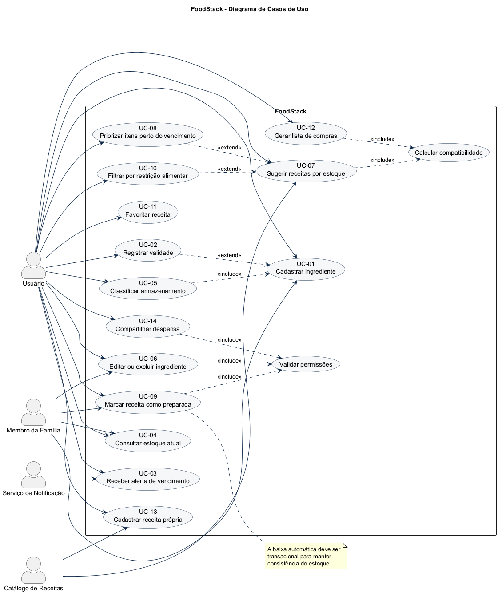
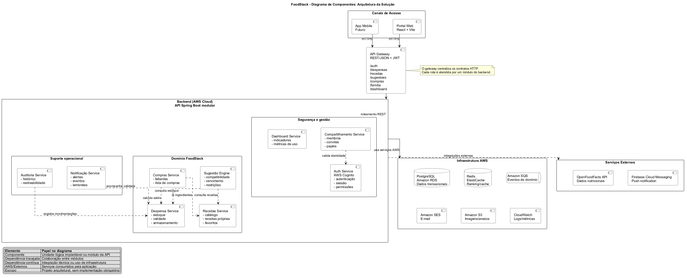
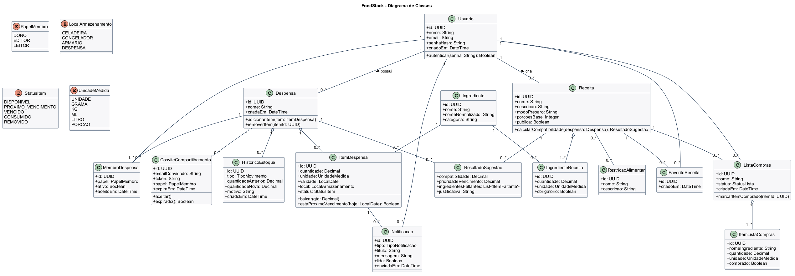
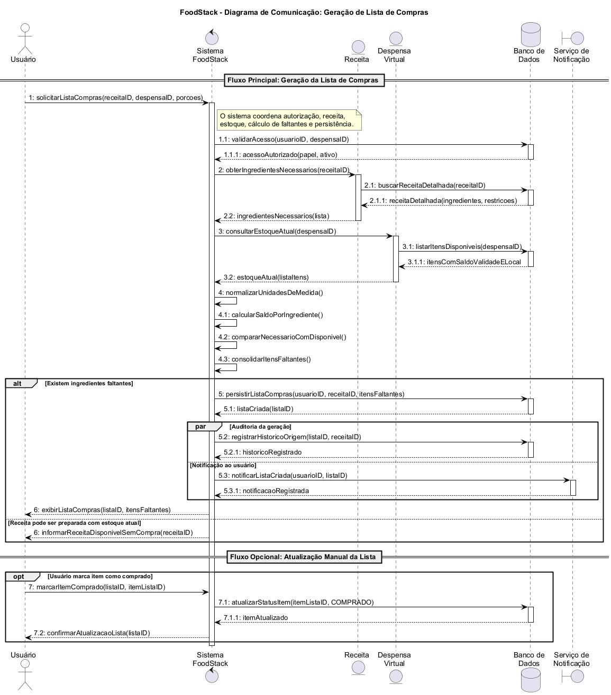
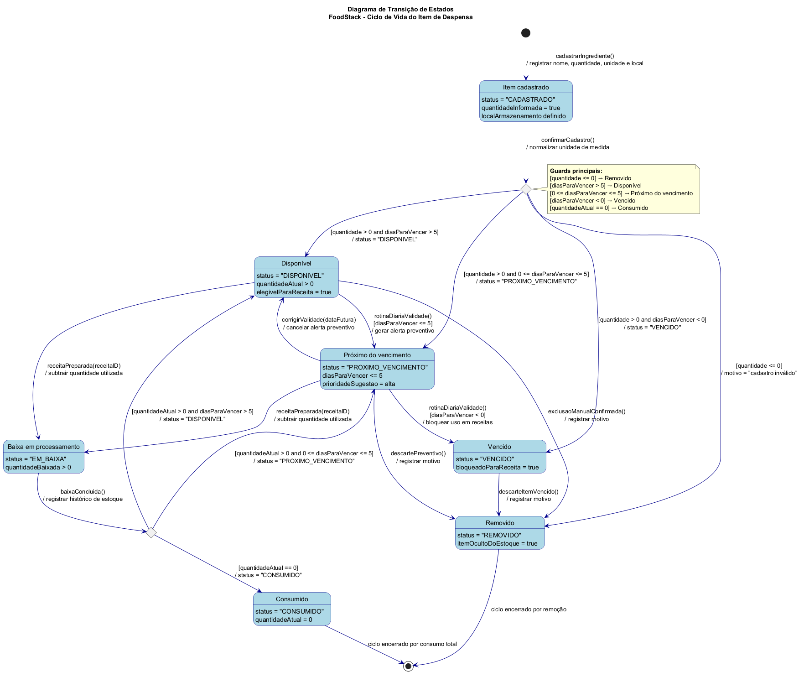
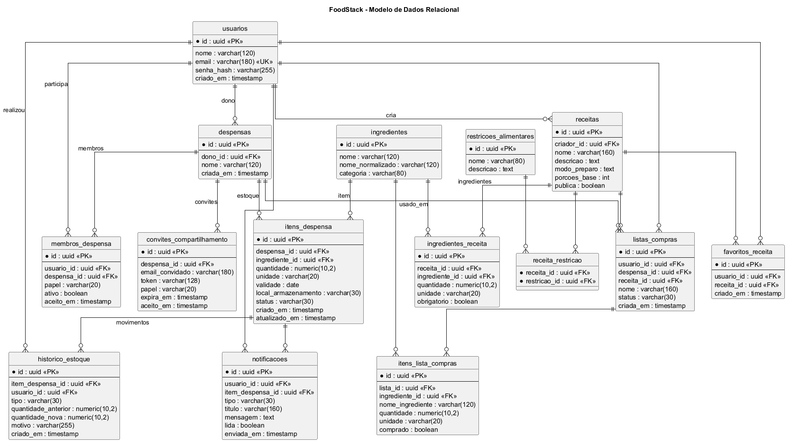

# Documentação de Projeto
## para o sistema
# FoodStack

**Versão 1.0**

Projeto de sistema elaborado pelo aluno **Pedro Henrique** 
como parte da disciplina **Projeto de Software**.

**21 de junho de 2026**

  

---

## Tabela de Conteúdo

1. [Introdução](#1-introdução)
2. [Modelos de Usuário e Requisitos](#2-modelos-de-usuário-e-requisitos)
   - 2.1 [Descrição de Atores](#21-descrição-de-atores)
   - 2.2 [Modelo de Casos de Uso e Histórias de Usuários](#22-modelo-de-casos-de-uso-e-histórias-de-usuários)
   - 2.3 [Diagrama de Sequência do Sistema e Contrato de Operações](#23-diagrama-de-sequência-do-sistema-e-contrato-de-operações)
3. [Modelos de Projeto](#3-modelos-de-projeto)
   - 3.1 [Arquitetura](#31-arquitetura)
   - 3.2 [Diagrama de Componentes e Implantação](#32-diagrama-de-componentes-e-implantação)
   - 3.3 [Diagrama de Classes](#33-diagrama-de-classes)
   - 3.4 [Diagramas de Sequência](#34-diagramas-de-sequência)
   - 3.5 [Diagramas de Comunicação](#35-diagramas-de-comunicação)
   - 3.6 [Diagramas de Estados](#36-diagramas-de-estados)
4. [Modelos de Dados](#4-modelos-de-dados)

---

## Histórico de Revisões

| Nome | Data | Razões para Mudança | Versão |
|---|---|---|---|
| Pedro Henrique | 21/06/2026 | Elaboração da documentação final conforme o template obrigatório. | 1.0 |

---

## 1. Introdução

Este documento agrega a elaboração e a revisão dos modelos de domínio, requisitos, projeto e dados para o sistema **FoodStack**. A referência principal é o problema do desperdício doméstico de alimentos, causado pela falta de controle sobre estoque, validade e planejamento de refeições.

O FoodStack é uma despensa virtual compartilhável que registra ingredientes, quantidades, unidades de medida, locais de armazenamento e datas de validade. Com esses dados, o sistema alerta sobre vencimentos, recomenda receitas compatíveis, prioriza alimentos que precisam ser consumidos, atualiza o estoque após o preparo e gera listas de compras.

Esta entrega é exclusivamente de **documentação, diagramação e arquitetura**. As tecnologias descritas são fictícias e planejadas, conforme solicitado na atividade. Não há código executável da aplicação.

**Objetivos principais:**

- reduzir o desperdício de alimentos;
- facilitar o planejamento de refeições;
- evitar compras duplicadas;
- recomendar receitas de acordo com o estoque;
- permitir o compartilhamento da despensa entre familiares.

**Documentos e fontes do projeto:**

- [Documento Word no template obrigatório](docs/FoodStack%20-%20Documenta%C3%A7%C3%A3o%20de%20Projeto.docx)
- [Códigos PlantUML](docs/plantuml)
- [Diagramas renderizados](docs/diagramas)

---

## 2. Modelos de Usuário e Requisitos

Os requisitos foram definidos a partir das necessidades de uma família que administra uma despensa compartilhada. O sistema diferencia permissões, protege as operações de alteração e mantém o estoque consistente durante o preparo de receitas.

### 2.1 Descrição de Atores

Nesta subseção é apresentada a descrição de cada ator que interage com o sistema.

| Ator | Descrição | Responsabilidades |
|---|---|---|
| **Dono da Despensa** | Usuário que cria e administra uma despensa. | Gerenciar itens, convidar membros, alterar permissões e excluir a despensa. |
| **Editor** | Membro autorizado a alterar o conteúdo da despensa. | Cadastrar, editar e remover itens; preparar receitas e atualizar o estoque. |
| **Leitor** | Membro com acesso apenas para consulta. | Consultar estoque, receitas sugeridas, alertas e listas de compras. |
| **Serviço de Notificação** | Serviço externo responsável pelos avisos. | Enviar alertas de validade por e-mail ou notificação push. |
| **Catálogo de Receitas** | Serviço que fornece receitas candidatas. | Disponibilizar receitas, ingredientes e restrições para o motor de recomendação. |

### 2.2 Modelo de Casos de Uso e Histórias de Usuários

O diagrama utiliza identificadores no formato `UC-XX`, permitindo referência nos contratos e demais modelos.

  

[Código PlantUML do diagrama de casos de uso](docs/plantuml/01-casos-de-uso.puml)

**Histórias de usuários principais:**

| ID | História de Usuário | Caso de Uso |
|---|---|---|
| US-01 | Como usuário, quero cadastrar ingredientes para manter meu estoque atualizado. | UC-01 |
| US-02 | Como usuário, quero registrar datas de validade para evitar desperdícios. | UC-02 |
| US-03 | Como usuário, quero receber alertas para consumir itens antes do vencimento. | UC-03 |
| US-04 | Como usuário, quero consultar o estoque para saber quais alimentos possuo. | UC-04 |
| US-05 | Como usuário, quero receber sugestões de receitas compatíveis com minha despensa. | UC-07 |
| US-06 | Como usuário, quero priorizar receitas com alimentos próximos do vencimento. | UC-08 |
| US-07 | Como usuário, quero registrar o preparo para baixar automaticamente o estoque. | UC-09 |
| US-08 | Como usuário, quero filtrar receitas por restrições alimentares. | UC-10 |
| US-09 | Como usuário, quero gerar uma lista com ingredientes faltantes. | UC-12 |
| US-10 | Como dono, quero compartilhar a despensa com minha família. | UC-14 |

### 2.3 Diagrama de Sequência do Sistema e Contrato de Operações

Nesta subseção são apresentados os diagramas de sequência do sistema para quatro casos de uso, superando o mínimo de três fluxos solicitado pelo template.

**UC-07, UC-08 e UC-10 - Sugestão de receitas**

  

[Código PlantUML](docs/plantuml/05a-sequencia-sugestao-receitas.puml)

**UC-09 - Preparo de receita e baixa automática**

  

[Código PlantUML](docs/plantuml/05b-sequencia-preparo-baixa-estoque.puml)

**UC-12 - Geração de lista de compras**

  

[Código PlantUML](docs/plantuml/05c-sequencia-lista-compras.puml)

**UC-03 - Alerta automático de vencimento**

  

[Código PlantUML](docs/plantuml/05d-sequencia-alerta-vencimento.puml)

**Formato para cada contrato de operação**

| Campo | CO-01 |
|---|---|
| **Contrato** | Cadastrar ingrediente |
| **Operação** | `cadastrarIngrediente(despensaId, item)` |
| **Referências cruzadas** | UC-01, US-01, RN-01 |
| **Pré-condições** | Usuário autenticado com papel Dono ou Editor; despensa existente. |
| **Pós-condições** | Item persistido com quantidade positiva, unidade e registro no histórico. |

| Campo | CO-03 |
|---|---|
| **Contrato** | Sugerir receitas |
| **Operação** | `sugerirReceitas(despensaId, filtros)` |
| **Referências cruzadas** | UC-07, UC-08, UC-10, US-05, US-06, US-08 |
| **Pré-condições** | Usuário com acesso à despensa; estoque disponível para consulta. |
| **Pós-condições** | Lista de receitas ordenada por compatibilidade, validade e restrições. |

| Campo | CO-04 |
|---|---|
| **Contrato** | Preparar receita |
| **Operação** | `prepararReceita(despensaId, receitaId, porcoes)` |
| **Referências cruzadas** | UC-09, US-07, RN-10, RN-11, RN-12 |
| **Pré-condições** | Receita existente; estoque suficiente; usuário com permissão de edição. |
| **Pós-condições** | Preparo registrado e estoque atualizado em transação única. |

| Campo | CO-05 |
|---|---|
| **Contrato** | Gerar lista de compras |
| **Operação** | `gerarListaCompras(despensaId, receitaId)` |
| **Referências cruzadas** | UC-12, US-09, RN-13 |
| **Pré-condições** | Receita e despensa existentes; usuário com acesso. |
| **Pós-condições** | Lista criada somente com ingredientes ausentes ou insuficientes. |

| Campo | CO-06 |
|---|---|
| **Contrato** | Convidar membro |
| **Operação** | `convidarMembro(despensaId, email, papel)` |
| **Referências cruzadas** | UC-14, US-10, RN-14, RN-15 |
| **Pré-condições** | Solicitante é o dono; e-mail e papel são válidos. |
| **Pós-condições** | Convite criado com token único e validade de sete dias. |

---

## 3. Modelos de Projeto

Os modelos de projeto detalham como os requisitos serão realizados por componentes, classes, interações, estados e infraestrutura.

### 3.1 Arquitetura

O FoodStack foi projetado como um **monólito modular orientado a domínio**, organizado nas camadas de interface, aplicação, domínio e infraestrutura.

| Camada | Responsabilidade | Tecnologias fictícias planejadas |
|---|---|---|
| Interface | Aplicação web responsiva e futuro aplicativo mobile. | React 19, TypeScript, Vite, React Native |
| Aplicação | Orquestração de casos de uso, transações e autorização. | Java 21, Spring Boot 3.4 |
| Domínio | Entidades, políticas, regras e invariantes do negócio. | Java, Domain-Driven Design |
| Infraestrutura | Persistência, cache, mensageria, notificações e observabilidade. | PostgreSQL 16, Redis, RabbitMQ, AWS, OpenTelemetry |

A arquitetura adota Repository, Service Layer, DTO, Strategy e Observer. O monólito modular reduz a complexidade operacional sem perder separação de responsabilidades.

O diagrama de componentes da Seção 3.2 representa a visão arquitetural UML adotada para a solução.

### 3.2 Diagrama de Componentes e Implantação.

O diagrama de componentes apresenta os módulos, serviços externos e dependências planejadas.

  

[Código PlantUML do diagrama de componentes](docs/plantuml/02-diagrama-componentes.puml)

O diagrama de implantação mostra onde os componentes estarão alocados para execução na infraestrutura fictícia.

  

[Código PlantUML do diagrama de implantação](docs/plantuml/09-diagrama-implantacao.puml)

### 3.3 Diagrama de Classes

O diagrama de classes representa os principais conceitos do domínio, seus atributos, operações e relacionamentos.

  

[Código PlantUML do diagrama de classes](docs/plantuml/03-diagrama-classes.puml)

As entidades centrais são `Usuario`, `Despensa`, `MembroDespensa`, `ItemDespensa`, `Ingrediente`, `Receita`, `IngredienteReceita`, `ListaCompras` e `Notificacao`.

### 3.4 Diagramas de Sequência

Os diagramas de sequência para realização dos casos de uso foram apresentados integralmente na [Seção 2.3](#23-diagrama-de-sequência-do-sistema-e-contrato-de-operações):

- sugestão de receitas por estoque;
- preparo e baixa automática;
- geração de lista de compras;
- alerta automático de vencimento.

Como modelo complementar, o diagrama de atividade abaixo detalha o fluxo decisório do alerta de vencimento.

  

[Código PlantUML do diagrama de atividade](docs/plantuml/06-diagrama-atividade-alerta-vencimento.puml)

### 3.5 Diagramas de Comunicação

O diagrama de comunicação apresenta as mensagens trocadas entre interface, aplicação, domínio e repositórios durante a geração da lista de compras.

  

[Código PlantUML do diagrama de comunicação](docs/plantuml/08-diagrama-comunicacao-lista-compras.puml)

### 3.6 Diagramas de Estados

O diagrama de estados representa o ciclo de vida de um item da despensa, desde o cadastro até o consumo, vencimento ou descarte.

  

[Código PlantUML do diagrama de estados](docs/plantuml/07-diagrama-estados-item-despensa.puml)

---

## 4. Modelos de Dados

O modelo de dados apresenta o esquema relacional planejado e a estratégia de mapeamento entre objetos do domínio e tabelas PostgreSQL.

  

[Código PlantUML do modelo de dados](docs/plantuml/04-modelo-dados-der.puml)

| Objeto de Domínio | Representação Relacional | Estratégia de Mapeamento |
|---|---|---|
| `Usuario` | `usuarios` | Entidade JPA com identificador UUID e e-mail único. |
| `Despensa` | `despensas` | Agregado raiz associado ao usuário proprietário. |
| `MembroDespensa` | `membros_despensa` | Associação N:N com papel e restrição única por usuário/despensa. |
| `Ingrediente` | `ingredientes` | Catálogo normalizado e reutilizado pelos itens e receitas. |
| `ItemDespensa` | `itens_despensa` | Entidade com quantidade, unidade, validade, local e controle de versão. |
| `Receita` | `receitas` | Entidade de catálogo ou receita criada pelo usuário. |
| `IngredienteReceita` | `ingredientes_receita` | Entidade associativa com quantidade e obrigatoriedade. |
| `ListaCompras` | `listas_compras` e `itens_lista_compras` | Agregado composto pelos ingredientes faltantes. |
| `Notificacao` | `notificacoes` | Registro persistente de alertas e status de envio. |

**Estratégias de persistência:**

- PostgreSQL para integridade referencial e transações;
- Hibernate/JPA para mapeamento objeto-relacional;
- Flyway para versionamento do esquema;
- bloqueio otimista em `ItemDespensa` para evitar perda de atualização;
- transação única durante a baixa dos ingredientes de uma receita;
- histórico de estoque para auditoria das alterações.

---

  

