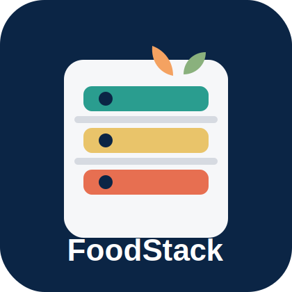
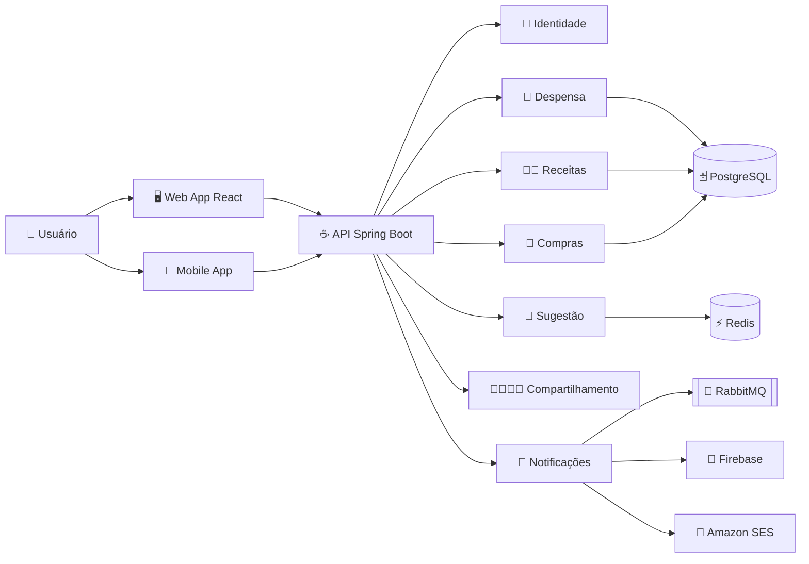
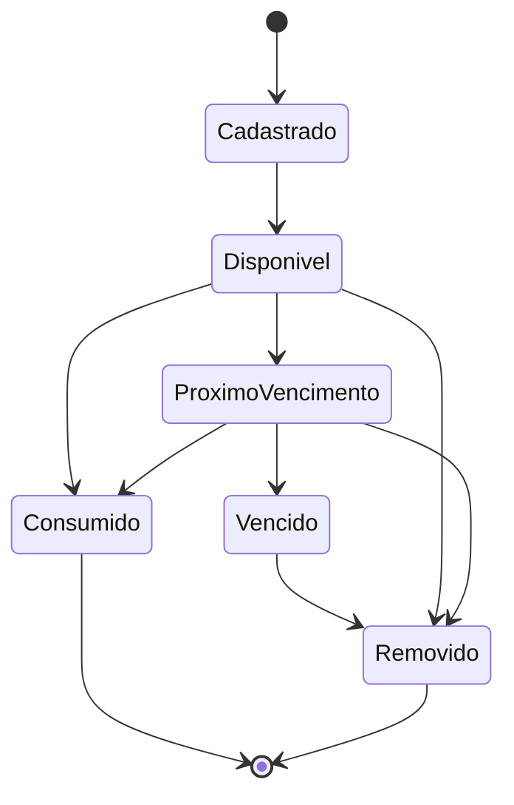
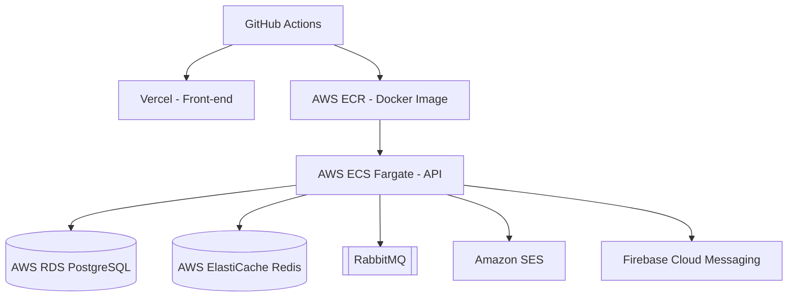

# 🍽️ FoodStack

> **Despensa Virtual & Gerador Inteligente de Receitas**  
> Projeto acadêmico de **documentação, arquitetura, modelagem UML e diagramação com PlantUML**.

<p align="center">
  
</p>

<p align="center">
  
  
  
  
  
</p>

<p align="center">
  
  
  
  
  
</p>

---

<a id="atalhos"></a>

## 🧭 Atalhos rápidos

| Quero ver... | Atalho |
|---|---|
| ✅ O que foi entregue | [Escopo da entrega](#escopo) |
| 🧠 Problema, solução e valor | [Sobre o projeto](#sobre) |
| 🧾 Histórias de usuário | [Histórias de usuário](#historias) |
| 📐 Regras de negócio | [Regras de negócio](#regras) |
| 🔁 Contratos de operação | [Contratos de operação](#contratos) |
| 🏗️ Arquitetura técnica | [Arquitetura](#arquitetura) |
| 🛠️ Tecnologias fictícias | [Tecnologias planejadas](#tecnologias) |
| 🌱 Código PlantUML obrigatório | [Diagramas PlantUML](#plantuml) |
| 🗄️ Modelo de dados | [Modelo de dados](#dados) |
| 🧭 Rastreabilidade | [Matriz de rastreabilidade](#rastreabilidade) |
| 🏆 Checklist para nota máxima | [Checklist de avaliação](#checklist) |

---

<a id="indice"></a>

## 📚 Índice completo

- [📌 Escopo da entrega](#escopo)
- [🧠 Sobre o projeto](#sobre)
- [✨ Funcionalidades principais](#funcionalidades)
- [👥 Atores do sistema](#atores)
- [🧾 Histórias de usuário](#historias)
- [📋 Backlog priorizado](#backlog)
- [📐 Regras de negócio](#regras)
- [🔁 Contratos de operação](#contratos)
- [🏗️ Arquitetura](#arquitetura)
- [🧩 Módulos do sistema](#modulos)
- [🧠 Padrões de projeto](#padroes)
- [🛠️ Tecnologias planejadas](#tecnologias)
- [🌱 Diagramas UML com PlantUML](#plantuml)
- [🧬 Modelo de domínio](#dominio)
- [🗄️ Modelo de dados](#dados)
- [🔌 API planejada](#api)
- [🚀 Deploy planejado](#deploy)
- [🧪 Qualidade e testes](#testes)
- [🧭 Matriz de rastreabilidade](#rastreabilidade)
- [📁 Estrutura de pastas](#estrutura)
- [🏆 Checklist de avaliação](#checklist)
- [📖 Referências](#referencias)
- [👤 Autor](#autor)
- [📜 Licença](#licenca)

---

<a id="escopo"></a>

## 📌 Escopo da entrega

Este repositório foi organizado para cumprir exatamente o exercício:

| Exigência do exercício | Como foi atendida |
|---|---|
| **Trabalho individual** | Projeto documentado como entrega individual. |
| **Uso obrigatório de PlantUML** | Todos os diagramas foram escritos em arquivos `.puml`. |
| **Adicionar o código PlantUML ao repositório** | Código disponível em [`docs/plantuml`](docs/plantuml). |
| **Não desenvolver código da aplicação** | Não há `backend`, `frontend`, classes implementadas ou código executável de sistema. |
| **Entregar projeto, diagramação e arquitetura** | Todo o projeto está consolidado neste `README.md`. |
| **Usar template de README solicitado** | README contém status, links, sobre, funcionalidades, tecnologias, arquitetura, execução, deploy, testes, documentação, autor e licença. |
| **Tecnologias fictícias do projeto** | Stack planejada descrita com React, Spring Boot, PostgreSQL, Docker, AWS e outras ferramentas. |

> ✅ A entrega final foi simplificada para ficar objetiva: **um README completo + pasta PlantUML**.  
> 🧹 Os documentos Markdown auxiliares foram consolidados neste arquivo principal.

[⬆️ Voltar aos atalhos](#atalhos)

---

<a id="sobre"></a>

## 🧠 Sobre o projeto

O **FoodStack** é um projeto de software para uma aplicação de **despensa virtual** com **geração inteligente de receitas**. O sistema permite que usuários cadastrem ingredientes disponíveis em casa, controlem quantidades, registrem datas de validade, recebam alertas de vencimento e descubram receitas que podem ser preparadas com o estoque atual.

### ❌ Problema

Em muitas casas, alimentos vencem porque ficam esquecidos na geladeira, compras são repetidas por falta de visibilidade do estoque e a decisão diária sobre o que cozinhar exige tempo. Isso gera desperdício, gastos desnecessários e baixa organização doméstica.

### ✅ Solução proposta

O FoodStack centraliza a despensa em uma interface digital, cruza o estoque com receitas cadastradas e recomenda pratos conforme:

- ingredientes disponíveis;
- quantidade suficiente ou insuficiente;
- validade próxima;
- restrições alimentares;
- receitas favoritas;
- receitas próprias do usuário.

### 💡 Valor para o usuário

| Valor | Explicação |
|---|---|
| 🥫 Controle | O usuário sabe exatamente o que possui na despensa. |
| ⏰ Prevenção | Alertas evitam o vencimento silencioso de alimentos. |
| 👨‍🍳 Decisão rápida | O sistema sugere receitas possíveis com o estoque atual. |
| 🛒 Compra eficiente | A lista de compras contém apenas itens faltantes. |
| 👨‍👩‍👧‍👦 Colaboração | Membros da família atualizam a mesma despensa. |
| 🌱 Menos desperdício | Itens próximos do vencimento são priorizados nas sugestões. |

[⬆️ Voltar aos atalhos](#atalhos)

---

<a id="funcionalidades"></a>

## ✨ Funcionalidades principais

| Módulo | Funcionalidade | Descrição |
|---|---|---|
| 🥫 Estoque | Cadastro manual de ingredientes | Registro de nome, quantidade, unidade, validade e local. |
| ⏰ Validade | Alerta de vencimento | Notifica itens próximos da data de validade. |
| 📦 Despensa | Visualização do estoque | Lista todos os itens disponíveis e seus detalhes. |
| 🧊 Armazenamento | Categorização física | Classifica itens por Geladeira, Congelador, Armário ou Despensa. |
| ✏️ Estoque | Edição e exclusão | Permite corrigir quantidades ou remover itens. |
| 👨‍🍳 Receitas | Sugestão por estoque | Recomenda receitas usando itens já disponíveis. |
| 🚨 Receitas | Foco em vencimento | Prioriza receitas com ingredientes prestes a vencer. |
| 🔄 Estoque | Baixa automática | Subtrai ingredientes quando uma receita é preparada. |
| 🥗 Receitas | Restrições alimentares | Filtra receitas vegetarianas, veganas, sem glúten e sem lactose. |
| ⭐ Receitas | Favoritos | Salva receitas preferidas do usuário. |
| 🛒 Compras | Lista automática | Calcula ingredientes ausentes ou insuficientes. |
| 🧑‍🍳 Receitas | Receitas próprias | Permite cadastrar receitas do próprio usuário. |
| 👨‍👩‍👧‍👦 Compartilhamento | Despensa familiar | Permite convite de membros com permissões. |

[⬆️ Voltar aos atalhos](#atalhos)

---

<a id="atores"></a>

## 👥 Atores do sistema

| Ator | Descrição | Responsabilidades |
|---|---|---|
| 👤 **Usuário** | Pessoa que utiliza o sistema para controlar alimentos e receitas. | Cadastrar ingredientes, consultar estoque, preparar receitas e gerar listas. |
| 👑 **Dono da despensa** | Usuário responsável pela despensa principal. | Gerenciar membros, permissões, convites e exclusão da despensa. |
| 👨‍👩‍👧‍👦 **Membro da família** | Usuário convidado para uma despensa compartilhada. | Consultar ou alterar itens conforme permissão recebida. |
| 🔔 **Serviço de notificação** | Serviço externo ou interno de mensagens. | Enviar alertas de vencimento por e-mail, push ou notificação interna. |
| 📚 **Catálogo de receitas** | Fonte de receitas do sistema. | Fornecer receitas candidatas e aceitar receitas próprias. |

[⬆️ Voltar aos atalhos](#atalhos)

---

<a id="historias"></a>

## 🧾 Histórias de usuário

### 🥫 Gestão de estoque

| ID | História de usuário |
|---|---|
| **US-01** | Como usuário, eu quero adicionar novos ingredientes à minha despensa virtual informando nome e quantidade, para manter o controle do que tenho em casa. |
| **US-02** | Como usuário, eu quero poder registrar a data de validade ao adicionar um ingrediente, para evitar o consumo de produtos estragados. |
| **US-03** | Como usuário, eu quero receber notificações sobre ingredientes que estão próximos da data de validade, para priorizar o uso desses itens e evitar o desperdício de alimentos. |
| **US-04** | Como usuário, eu quero visualizar uma lista completa de todos os itens disponíveis na minha despensa, para saber rapidamente o que tenho sem precisar abrir os armários. |
| **US-05** | Como usuário, eu quero classificar onde o ingrediente está guardado, como Geladeira, Congelador ou Armário, para facilitar a localização física na minha cozinha. |
| **US-06** | Como usuário, eu quero alterar a quantidade ou excluir um ingrediente da despensa, para corrigir erros de cadastro ou registrar itens descartados. |

### 👨‍🍳 Geração e gestão de receitas

| ID | História de usuário |
|---|---|
| **US-07** | Como usuário, eu quero que o sistema sugira receitas utilizando apenas ou majoritariamente os ingredientes que já possuo na despensa, para decidir o que cozinhar sem precisar ir ao mercado. |
| **US-08** | Como usuário, eu quero uma opção de sugerir receitas que utilizem especificamente os ingredientes que estão prestes a vencer, para não perder os alimentos que estão na geladeira. |
| **US-09** | Como usuário, eu quero que ao marcar uma receita como preparada o sistema subtraia automaticamente as quantidades utilizadas da minha despensa virtual, para manter o estoque sempre atualizado. |
| **US-10** | Como usuário, eu quero filtrar as receitas sugeridas por restrições, como sem glúten ou vegetariano, para garantir que as sugestões atendam à minha dieta. |
| **US-11** | Como usuário, eu quero salvar as receitas sugeridas em uma lista de favoritos, para poder encontrá-las facilmente no futuro. |

### 🧩 Funcionalidades extras

| ID | História de usuário |
|---|---|
| **US-12** | Como usuário, eu quero escolher uma receita que desejo fazer e que o sistema gere automaticamente uma lista de compras com os ingredientes que faltam na minha despensa, para facilitar minha ida ao mercado. |
| **US-13** | Como usuário, eu quero poder cadastrar minhas próprias receitas no banco de dados do sistema, para que elas também apareçam nas sugestões quando eu tiver os ingredientes. |
| **US-14** | Como usuário, eu quero compartilhar o acesso da minha despensa com outros membros da família, para que todos possam adicionar ou remover itens de forma sincronizada. |

[⬆️ Voltar aos atalhos](#atalhos)

---

<a id="backlog"></a>

## 📋 Backlog priorizado

### Épicos

| Épico | Descrição | Histórias |
|---|---|---|
| **EP-01 - Gestão de Estoque** | Controle de ingredientes, quantidades, validade e armazenamento físico. | US-01 a US-06 |
| **EP-02 - Geração e Gestão de Receitas** | Sugestão, preparo, restrições, favoritos e baixa automática. | US-07 a US-11 |
| **EP-03 - Funcionalidades Extras** | Lista de compras, receitas próprias e compartilhamento familiar. | US-12 a US-14 |

### Priorização MoSCoW

| Categoria | Itens | Justificativa |
|---|---|---|
| **Must have** | US-01, US-02, US-03, US-04, US-06, US-07, US-09 | Núcleo mínimo para despensa, validade, sugestão e baixa. |
| **Should have** | US-05, US-08, US-10, US-12 | Recursos importantes para organização e decisão. |
| **Could have** | US-11, US-13, US-14 | Melhorias de experiência e colaboração. |
| **Won't have na v1** | Integração com mercado, reconhecimento por foto, IA generativa | Fora do escopo do projeto arquitetural inicial. |

### Critérios de aceitação resumidos

| História | Critérios de aceitação |
|---|---|
| **US-01** | Nome obrigatório, quantidade positiva, unidade válida e item visível na despensa após salvar. |
| **US-02** | Validade opcional; se vencida, exige confirmação; data aparece na listagem. |
| **US-03** | Itens com validade em até 5 dias geram alerta; máximo de um alerta diário por item. |
| **US-04** | Lista mostra nome, quantidade, unidade, local e validade; permite filtros. |
| **US-05** | Local aceita Geladeira, Congelador, Armário ou Despensa; permite edição posterior. |
| **US-06** | Edição de quantidade, unidade, validade e local; exclusão exige confirmação. |
| **US-07** | Sugestões mostram compatibilidade, faltantes e receitas completas primeiro. |
| **US-08** | Modo de vencimento prioriza receitas com mais itens próximos da validade. |
| **US-09** | Baixa valida estoque, executa transação única e rejeita preparo insuficiente. |
| **US-10** | Filtros removem receitas incompatíveis com restrições selecionadas. |
| **US-11** | Usuário pode favoritar e desfavoritar receitas; favoritos são pessoais. |
| **US-12** | Lista contém apenas itens ausentes ou insuficientes, com quantidades calculadas. |
| **US-13** | Receita própria exige nome, preparo e pelo menos um ingrediente. |
| **US-14** | Dono convida por e-mail; convite expira em 7 dias; papéis controlam permissões. |

[⬆️ Voltar aos atalhos](#atalhos)

---

<a id="regras"></a>

## 📐 Regras de negócio

### Cadastro e estoque

| ID | Regra |
|---|---|
| **RN-01** | Todo item de despensa deve possuir nome, quantidade positiva, unidade de medida e local de armazenamento. |
| **RN-02** | A data de validade é opcional; quando informada, deve aceitar datas futuras e exigir confirmação para datas já vencidas. |
| **RN-03** | Um item é considerado próximo do vencimento quando sua validade ocorrer em até **5 dias corridos**. |
| **RN-04** | O sistema deve gerar no máximo uma notificação diária por item próximo do vencimento. |
| **RN-05** | A visualização do estoque deve ocultar itens com quantidade igual a zero, exceto em consulta histórica. |
| **RN-06** | Edição, exclusão e baixa de item devem registrar data, usuário responsável e motivo quando aplicável. |
| **RN-07** | Itens de uma mesma despensa com mesmo ingrediente, unidade, validade e local podem ser consolidados. |
| **RN-08** | Ingredientes vencidos não podem ser usados como base de sugestão sem aviso explícito ao usuário. |
| **RN-09** | O nome do ingrediente deve ser normalizado para busca, removendo diferenças de maiúsculas/minúsculas e acentos. |
| **RN-10** | A exclusão de item disponível deve exigir confirmação para reduzir erros de descarte. |

### Sugestão e receitas

| ID | Regra |
|---|---|
| **RN-11** | O índice de compatibilidade da receita deve considerar a proporção entre ingredientes disponíveis e ingredientes necessários. |
| **RN-12** | No modo "priorizar vencimento", receitas que utilizam itens próximos do vencimento recebem pontuação adicional. |
| **RN-13** | O sistema deve explicar a recomendação informando ingredientes usados, faltantes e itens próximos do vencimento aproveitados. |
| **RN-14** | Ao preparar uma receita, a baixa de estoque deve ocorrer em uma única transação atômica. |
| **RN-15** | Caso algum item esteja insuficiente no momento da baixa, o preparo não deve ser concluído automaticamente. |
| **RN-16** | Receitas incompatíveis com restrições alimentares selecionadas não devem aparecer no resultado filtrado. |
| **RN-17** | Restrições alimentares devem ser validadas por marcação da receita e por ingredientes incompatíveis. |
| **RN-18** | Favoritos são pessoais e não devem ser compartilhados automaticamente com outros membros da despensa. |
| **RN-19** | A lista de compras deve conter apenas ingredientes ausentes ou insuficientes para a receita escolhida. |
| **RN-20** | Quantidades da lista de compras devem ser calculadas pela diferença entre quantidade necessária e quantidade disponível. |
| **RN-21** | Uma receita própria deve possuir nome, pelo menos um ingrediente e instruções de preparo. |
| **RN-22** | Receitas próprias só podem ser editadas pelo criador ou por usuário com permissão administrativa. |

### Compartilhamento e permissões

| ID | Regra |
|---|---|
| **RN-23** | Toda despensa deve possuir exatamente um dono responsável. |
| **RN-24** | Convites de compartilhamento expiram após 7 dias ou após o aceite. |
| **RN-25** | O perfil leitor pode consultar estoque e receitas, mas não pode alterar itens. |
| **RN-26** | O perfil editor pode cadastrar, alterar e remover itens, mas não pode excluir a despensa. |
| **RN-27** | O dono pode gerenciar membros, permissões, convites e exclusão da despensa. |
| **RN-28** | Operações realizadas por membros compartilhados devem aparecer no histórico da despensa. |

### Qualidade e integridade

| ID | Regra |
|---|---|
| **RN-29** | Todas as operações críticas devem validar autorização no back-end, independentemente da interface. |
| **RN-30** | Dados sensíveis do usuário devem ser protegidos e nunca retornados em respostas públicas da API. |
| **RN-31** | O sistema deve manter consistência entre estoque, receitas preparadas e lista de compras. |
| **RN-32** | Logs técnicos não devem registrar senha, token JWT ou dados sensíveis de autenticação. |

[⬆️ Voltar aos atalhos](#atalhos)

---

<a id="contratos"></a>

## 🔁 Contratos de operação

| Contrato | Operação | Responsabilidade | Pré-condições | Pós-condições | Exceções |
|---|---|---|---|---|---|
| **CO-01** | `cadastrarIngrediente(despensaId, nome, quantidade, unidade, validade, local)` | Inserir novo item na despensa. | Usuário autenticado e com papel de dono/editor. | Item criado, histórico registrado e alerta agendado quando houver validade. | Quantidade inválida, despensa inexistente, usuário sem permissão, validade vencida sem confirmação. |
| **CO-02** | `consultarEstoque(despensaId, filtros)` | Retornar itens disponíveis conforme filtros. | Usuário autenticado e membro da despensa. | Lista retornada com status de validade e local. | Despensa inexistente ou usuário sem acesso. |
| **CO-03** | `sugerirReceitas(despensaId, restricoes, priorizarVencimento)` | Gerar ranking de receitas compatíveis. | Despensa com pelo menos um item disponível. | Ranking com compatibilidade, faltantes e justificativa. | Nenhum item disponível, nenhuma receita compatível ou filtro inválido. |
| **CO-04** | `prepararReceita(despensaId, receitaId, porcoes)` | Registrar preparo e subtrair ingredientes do estoque. | Usuário editor/dono, receita existente e estoque suficiente. | Estoque atualizado, preparo registrado e histórico criado. | Estoque insuficiente, falha transacional, receita inexistente ou usuário sem permissão. |
| **CO-05** | `gerarListaCompras(despensaId, receitaId, porcoes)` | Calcular ingredientes faltantes. | Usuário membro da despensa e receita existente. | Lista criada com itens faltantes e quantidades calculadas. | Receita inexistente, unidade incompatível ou despensa inacessível. |
| **CO-06** | `convidarMembro(despensaId, email, papel)` | Enviar convite de acesso à despensa. | Usuário autenticado como dono, e-mail válido e papel permitido. | Convite criado, notificação enviada e expiração definida. | Usuário sem permissão, e-mail inválido, convite duplicado ou despensa inexistente. |
| **CO-07** | `cadastrarReceitaPropria(usuarioId, receita)` | Registrar receita do usuário no catálogo pessoal. | Usuário autenticado e receita válida. | Receita criada e disponível para sugestão. | Receita sem ingredientes, instruções ausentes ou ingrediente sem unidade. |

[⬆️ Voltar aos atalhos](#atalhos)

---

<a id="arquitetura"></a>

## 🏗️ Arquitetura

O FoodStack foi projetado como um **monólito modular com arquitetura em camadas e princípios hexagonais**.

Essa escolha foi feita porque o projeto é acadêmico, não exige microsserviços na primeira versão e precisa demonstrar separação clara entre responsabilidades sem aumentar a complexidade operacional.

### Visão geral



### Camadas

| Camada | Responsabilidade |
|---|---|
| 🎨 **Interface** | Clientes web/mobile, telas, formulários e chamadas HTTP. |
| 🔌 **Controllers REST** | Entrada da API, DTOs, autenticação e roteamento. |
| ⚙️ **Aplicação** | Orquestra casos de uso, transações e serviços. |
| 🧠 **Domínio** | Entidades, regras de negócio, políticas e eventos. |
| 🗄️ **Infraestrutura** | Banco, cache, filas, notificações e provedores externos. |

### Fluxo de dados

1. O usuário interage com o front-end web ou app mobile.
2. A interface envia requisições autenticadas para a API REST.
3. O controller converte a requisição em comando ou consulta.
4. O serviço de aplicação valida permissões e chama regras de domínio.
5. O domínio aplica políticas de estoque, validade, compatibilidade e restrições.
6. Repositórios persistem dados no PostgreSQL.
7. Eventos internos disparam histórico, alertas e notificações.
8. A API retorna DTOs para a interface.

### Trade-offs

| Decisão | Benefício | Custo |
|---|---|---|
| Monólito modular | Menor complexidade e deploy simples. | Escala por módulo não é imediata. |
| PostgreSQL | Integridade forte e transações confiáveis. | Busca semântica exigiria integração futura. |
| Eventos internos | Menos acoplamento entre módulos. | Exige rastreabilidade dos efeitos assíncronos. |
| REST | Simples, conhecido e fácil de documentar. | Pode exigir endpoints específicos para telas complexas. |

[⬆️ Voltar aos atalhos](#atalhos)

---

<a id="modulos"></a>

## 🧩 Módulos do sistema

| Módulo | Responsabilidade técnica |
|---|---|
| 🔐 **Identidade** | Login, cadastro, JWT, usuários e autorização. |
| 🥫 **Despensa** | Cadastro, edição, validade, local, histórico e baixa de estoque. |
| 👨‍🍳 **Receitas** | Catálogo, receitas próprias, ingredientes, favoritos e restrições. |
| 🧠 **Sugestão** | Compatibilidade, ranking, priorização por vencimento e filtros. |
| 🛒 **Compras** | Geração automática de lista de compras. |
| 👨‍👩‍👧‍👦 **Compartilhamento** | Convites, membros, papéis e permissões. |
| 🔔 **Notificações** | Alertas de vencimento por push, e-mail e notificação interna. |

[⬆️ Voltar aos atalhos](#atalhos)

---

<a id="padroes"></a>

## 🧠 Padrões de projeto

| Padrão | Aplicação no FoodStack |
|---|---|
| **Repository Pattern** | Isola persistência de usuários, despensas, itens e receitas. |
| **Service Layer** | Organiza casos de uso como cadastrar item, sugerir receita e preparar receita. |
| **DTO Pattern** | Define entrada e saída da API sem expor entidades internas. |
| **Mapper** | Converte entidades em respostas de API. |
| **Policy Object** | Encapsula regras de validade, permissões e compatibilidade. |
| **Domain Events** | Dispara eventos como `ItemProximoVencimento` e `ReceitaPreparada`. |
| **Transaction Boundary** | Garante baixa automática atômica ao preparar receita. |

[⬆️ Voltar aos atalhos](#atalhos)

---

<a id="tecnologias"></a>

## 🛠️ Tecnologias planejadas

As tecnologias abaixo são **fictícias** para uma futura implementação e foram escolhidas para demonstrar coerência arquitetural.

### 💻 Front-end

| Tecnologia | Versão | Uso |
|---|---:|---|
| React | 19 | Interface web reativa. |
| TypeScript | 5.8 | Tipagem estática. |
| Vite | 7 | Build e ambiente de desenvolvimento. |
| Tailwind CSS | 4 | Estilização responsiva. |
| TanStack Query | 5 | Cache e sincronização com API. |
| Zustand | 5 | Estado local. |
| Playwright | 1.50+ | Testes ponta a ponta. |

### ☕ Back-end

| Tecnologia | Versão | Uso |
|---|---:|---|
| Java | 21 | Linguagem principal. |
| Spring Boot | 3.4 | Framework da API. |
| Spring Security | 6 | Autenticação e autorização. |
| Spring Data JPA | 3 | Persistência. |
| Hibernate | 6 | ORM. |
| Flyway | 10 | Migrações de banco. |
| OpenAPI | 3.1 | Documentação de endpoints. |

### 🗄️ Dados e infraestrutura

| Tecnologia | Uso |
|---|---|
| PostgreSQL 16 | Banco principal. |
| Redis 7 | Cache de sugestões e consultas. |
| RabbitMQ 3.13 | Eventos de domínio. |
| Docker Compose | Ambiente local planejado. |
| GitHub Actions | CI/CD. |
| AWS ECS Fargate | Deploy planejado da API. |
| AWS RDS | Banco gerenciado. |
| Vercel | Deploy do front-end. |
| Firebase Cloud Messaging | Push notifications. |
| Amazon SES | E-mails transacionais. |

[⬆️ Voltar aos atalhos](#atalhos)

---

<a id="plantuml"></a>

## 🌱 Diagramas UML com PlantUML

O exercício exige uso de **PlantUML** e código PlantUML no repositório. Por isso, os diagramas foram mantidos como arquivos `.puml` em:

📁 [`docs/plantuml`](docs/plantuml)

### Arquivos PlantUML

| Nº | Tipo de diagrama | Arquivo |
|---:|---|---|
| 01 | 🎭 Casos de uso | [`01-casos-de-uso.puml`](docs/plantuml/01-casos-de-uso.puml) |
| 02 | 🧩 Componentes / arquitetura | [`02-arquitetura-componentes.puml`](docs/plantuml/02-arquitetura-componentes.puml) |
| 03 | 🧬 Classes | [`03-diagrama-classes.puml`](docs/plantuml/03-diagrama-classes.puml) |
| 04 | 🗄️ Modelo de dados / DER | [`04-modelo-dados-der.puml`](docs/plantuml/04-modelo-dados-der.puml) |
| 05 | 🔁 Sequência - sugestão de receita | [`05-sequencia-sugestao-receita.puml`](docs/plantuml/05-sequencia-sugestao-receita.puml) |
| 06 | 🔄 Sequência - preparar receita | [`06-sequencia-preparar-receita.puml`](docs/plantuml/06-sequencia-preparar-receita.puml) |
| 07 | 👨‍👩‍👧‍👦 Sequência - compartilhar despensa | [`07-sequencia-compartilhar-despensa.puml`](docs/plantuml/07-sequencia-compartilhar-despensa.puml) |
| 08 | ⏰ Atividade - alerta de vencimento | [`08-atividade-alerta-vencimento.puml`](docs/plantuml/08-atividade-alerta-vencimento.puml) |
| 09 | 📦 Estados do item de despensa | [`09-estados-item-despensa.puml`](docs/plantuml/09-estados-item-despensa.puml) |
| 10 | 🛒 Comunicação - lista de compras | [`10-comunicacao-lista-compras.puml`](docs/plantuml/10-comunicacao-lista-compras.puml) |
| 11 | ☁️ Implantação | [`11-implantacao.puml`](docs/plantuml/11-implantacao.puml) |

### Como renderizar os diagramas

```bash
java -jar plantuml.jar -tpng docs/plantuml/*.puml
```

Também é possível abrir os arquivos `.puml` diretamente em uma IDE com extensão PlantUML.

[⬆️ Voltar aos atalhos](#atalhos)

---

<a id="dominio"></a>

## 🧬 Modelo de domínio

### Entidades principais

| Entidade | Descrição |
|---|---|
| `Usuario` | Pessoa autenticada no sistema. |
| `Despensa` | Agrupa itens de estoque de um usuário ou família. |
| `MembroDespensa` | Representa participação e papel em uma despensa compartilhada. |
| `ConviteCompartilhamento` | Convite enviado para acesso familiar. |
| `Ingrediente` | Catálogo normalizado de ingredientes. |
| `ItemDespensa` | Ingrediente disponível, com quantidade, unidade, validade e local. |
| `HistoricoEstoque` | Registro de alterações, descartes e baixas. |
| `Receita` | Receita própria ou de catálogo. |
| `IngredienteReceita` | Relação entre receita e ingrediente necessário. |
| `RestricaoAlimentar` | Restrições como vegano, sem glúten ou sem lactose. |
| `FavoritoReceita` | Receita salva pelo usuário. |
| `ListaCompras` | Lista criada a partir de ingredientes faltantes. |
| `ItemListaCompras` | Item específico da lista de compras. |
| `Notificacao` | Alerta de validade ou ação relevante. |

### Ciclo de vida do item de despensa



[⬆️ Voltar aos atalhos](#atalhos)

---

<a id="dados"></a>

## 🗄️ Modelo de dados

O banco planejado é relacional, usando **PostgreSQL 16**, porque o sistema exige integridade forte entre despensa, itens, receitas preparadas, listas de compras e histórico.

### Tabelas planejadas

| Tabela | Finalidade |
|---|---|
| `usuarios` | Dados de autenticação e perfil. |
| `despensas` | Despensas criadas pelos usuários. |
| `membros_despensa` | Participação e papel dos usuários. |
| `convites_compartilhamento` | Convites pendentes, aceitos ou expirados. |
| `ingredientes` | Catálogo normalizado de ingredientes. |
| `itens_despensa` | Estoque real disponível. |
| `historico_estoque` | Auditoria de alterações e baixas. |
| `receitas` | Receitas públicas ou próprias. |
| `ingredientes_receita` | Composição das receitas. |
| `restricoes_alimentares` | Restrições alimentares. |
| `receita_restricao` | Associação entre receitas e restrições. |
| `favoritos_receita` | Receitas favoritas por usuário. |
| `listas_compras` | Listas geradas para receitas. |
| `itens_lista_compras` | Itens faltantes ou insuficientes. |
| `notificacoes` | Alertas enviados ao usuário. |

### Estratégia de mapeamento

| Origem no domínio | Representação no banco |
|---|---|
| `Usuario` | Tabela `usuarios` |
| `Despensa` | Tabela `despensas` |
| `ItemDespensa` | Tabela `itens_despensa` |
| `Receita` | Tabela `receitas` |
| `IngredienteReceita` | Tabela `ingredientes_receita` |
| `ListaCompras` | Tabelas `listas_compras` e `itens_lista_compras` |
| `Notificacao` | Tabela `notificacoes` |

[⬆️ Voltar aos atalhos](#atalhos)

---

<a id="api"></a>

## 🔌 API planejada

> A API abaixo é uma especificação de projeto. Não há implementação neste repositório.

| Método | Endpoint | Descrição |
|---|---|---|
| `POST` | `/api/auth/login` | Autentica usuário e retorna JWT. |
| `POST` | `/api/auth/register` | Registra novo usuário. |
| `GET` | `/api/despensas/{id}/itens` | Lista itens da despensa. |
| `POST` | `/api/despensas/{id}/itens` | Cadastra ingrediente no estoque. |
| `PUT` | `/api/despensas/{id}/itens/{itemId}` | Atualiza quantidade, validade ou local. |
| `DELETE` | `/api/despensas/{id}/itens/{itemId}` | Remove item da despensa. |
| `GET` | `/api/despensas/{id}/sugestoes` | Sugere receitas por estoque e filtros. |
| `POST` | `/api/receitas/{id}/preparos` | Marca receita como preparada e baixa estoque. |
| `POST` | `/api/receitas` | Cadastra receita própria. |
| `POST` | `/api/receitas/{id}/favoritos` | Favorita receita. |
| `DELETE` | `/api/receitas/{id}/favoritos` | Remove receita dos favoritos. |
| `POST` | `/api/despensas/{id}/listas-compras` | Gera lista de compras. |
| `POST` | `/api/despensas/{id}/convites` | Convida membro para despensa. |
| `POST` | `/api/convites/{token}/aceite` | Aceita convite de compartilhamento. |

### Exemplo de resposta futura

```json
{
  "receita": "Omelete de legumes",
  "compatibilidade": 0.92,
  "priorizaVencimento": true,
  "ingredientesUsados": ["ovos", "tomate", "queijo"],
  "ingredientesFaltantes": ["cebolinha"],
  "justificativa": "Usa tomate com vencimento em 2 dias e aproveita 92% do estoque disponível."
}
```

[⬆️ Voltar aos atalhos](#atalhos)

---

<a id="deploy"></a>

## 🚀 Deploy planejado



| Camada | Deploy planejado |
|---|---|
| 🖥️ Front-end | Vercel com build Vite. |
| ☕ API | AWS ECS Fargate com imagem Docker. |
| 🗄️ Banco | AWS RDS PostgreSQL. |
| ⚡ Cache | AWS ElastiCache Redis. |
| 📨 Eventos | RabbitMQ / Amazon MQ. |
| 🔔 Notificações | Firebase Cloud Messaging e Amazon SES. |
| 📊 Observabilidade | Prometheus, Grafana, OpenTelemetry e CloudWatch. |

[⬆️ Voltar aos atalhos](#atalhos)

---

<a id="testes"></a>

## 🧪 Qualidade e testes

Mesmo sem implementação, a estratégia de qualidade foi planejada para orientar a construção futura do sistema.

| Tipo | Ferramentas planejadas | O que validar |
|---|---|---|
| Unitário | JUnit, Mockito, Vitest | Regras de validade, compatibilidade, baixa e filtros. |
| Integração | Testcontainers, Spring Boot Test | Repositórios, transações e persistência. |
| Contrato | OpenAPI, Schemathesis | Endpoints e DTOs da API. |
| E2E | Playwright | Fluxos de cadastro, sugestão, preparo e compartilhamento. |
| Arquitetura | ArchUnit | Separação entre módulos e camadas. |
| Documentação | PlantUML | Sintaxe e cobertura dos diagramas. |

### Verificação da entrega

| Verificação | Resultado |
|---|---|
| Arquivos `.puml` criados | ✅ 11 arquivos |
| Pasta de documentação simplificada | ✅ apenas `docs/plantuml` |
| Código da aplicação removido/ausente | ✅ sem implementação |
| Conteúdo consolidado no README | ✅ requisitos, regras, arquitetura, contratos e rastreabilidade |
| README com atalhos | ✅ atalhos rápidos e índice completo |

[⬆️ Voltar aos atalhos](#atalhos)

---

<a id="rastreabilidade"></a>

## 🧭 Matriz de rastreabilidade

| História | Caso de uso | Regras | Diagrama PlantUML |
|---|---|---|---|
| **US-01** | UC-01 - Cadastrar ingrediente | RN-01, RN-09 | `01-casos-de-uso`, `03-diagrama-classes` |
| **US-02** | UC-02 - Registrar validade | RN-02, RN-03 | `01-casos-de-uso`, `09-estados-item-despensa` |
| **US-03** | UC-03 - Receber alerta de vencimento | RN-03, RN-04, RN-13 | `08-atividade-alerta-vencimento` |
| **US-04** | UC-04 - Consultar estoque atual | RN-05 | `01-casos-de-uso`, `04-modelo-dados-der` |
| **US-05** | UC-05 - Classificar armazenamento | RN-01, RN-05 | `03-diagrama-classes` |
| **US-06** | UC-06 - Editar ou excluir ingrediente | RN-06, RN-10 | `03-diagrama-classes`, `09-estados-item-despensa` |
| **US-07** | UC-07 - Sugerir receitas por estoque | RN-11, RN-13 | `05-sequencia-sugestao-receita` |
| **US-08** | UC-08 - Priorizar itens perto do vencimento | RN-12, RN-13 | `05-sequencia-sugestao-receita` |
| **US-09** | UC-09 - Marcar receita como preparada | RN-14, RN-15 | `06-sequencia-preparar-receita` |
| **US-10** | UC-10 - Filtrar por restrição alimentar | RN-16, RN-17 | `05-sequencia-sugestao-receita` |
| **US-11** | UC-11 - Favoritar receita | RN-18 | `03-diagrama-classes` |
| **US-12** | UC-12 - Gerar lista de compras | RN-19, RN-20 | `10-comunicacao-lista-compras` |
| **US-13** | UC-13 - Cadastrar receita própria | RN-21, RN-22 | `03-diagrama-classes`, `04-modelo-dados-der` |
| **US-14** | UC-14 - Compartilhar despensa | RN-23 a RN-28 | `07-sequencia-compartilhar-despensa` |

[⬆️ Voltar aos atalhos](#atalhos)

---

<a id="estrutura"></a>

## 📁 Estrutura de pastas

A estrutura foi simplificada para atender ao pedido de deixar tudo em um único README e manter apenas o PlantUML em `docs`.

```text
foodstack/
├── README.md
├── LICENSE
├── .gitignore
├── assets/
│   ├── logo-foodstack.svg
│   └── logo-foodstack.png
└── docs/
    └── plantuml/
        ├── 01-casos-de-uso.puml
        ├── 02-arquitetura-componentes.puml
        ├── 03-diagrama-classes.puml
        ├── 04-modelo-dados-der.puml
        ├── 05-sequencia-sugestao-receita.puml
        ├── 06-sequencia-preparar-receita.puml
        ├── 07-sequencia-compartilhar-despensa.puml
        ├── 08-atividade-alerta-vencimento.puml
        ├── 09-estados-item-despensa.puml
        ├── 10-comunicacao-lista-compras.puml
        └── 11-implantacao.puml
```

[⬆️ Voltar aos atalhos](#atalhos)

---

<a id="checklist"></a>

## 🏆 Checklist de avaliação

| Critério provável de avaliação | Status | Evidência |
|---|---:|---|
| Projeto individual identificado | ✅ | README |
| Nome do projeto definido como FoodStack | ✅ | Título e logo |
| Domínio escolhido e explicado | ✅ | Despensa virtual e receitas |
| README baseado no template solicitado | ✅ | Seções completas neste arquivo |
| Tecnologias fictícias informadas | ✅ | [Tecnologias planejadas](#tecnologias) |
| Sem implementação de código | ✅ | Não há backend/frontend implementados |
| Histórias de usuário incluídas | ✅ | [Histórias de usuário](#historias) |
| Regras de negócio escolhidas | ✅ | [Regras de negócio](#regras) |
| Arquitetura explicada | ✅ | [Arquitetura](#arquitetura) |
| Uso obrigatório de PlantUML | ✅ | [Diagramas PlantUML](#plantuml) |
| Código PlantUML versionado | ✅ | [`docs/plantuml`](docs/plantuml) |
| Casos de uso | ✅ | `01-casos-de-uso.puml` |
| Componentes / arquitetura | ✅ | `02-arquitetura-componentes.puml` |
| Diagrama de classes | ✅ | `03-diagrama-classes.puml` |
| Modelo de dados | ✅ | `04-modelo-dados-der.puml` |
| Diagramas de sequência | ✅ | `05`, `06` e `07` |
| Diagrama de atividade | ✅ | `08-atividade-alerta-vencimento.puml` |
| Diagrama de estados | ✅ | `09-estados-item-despensa.puml` |
| Diagrama de comunicação | ✅ | `10-comunicacao-lista-compras.puml` |
| Diagrama de implantação | ✅ | `11-implantacao.puml` |
| Contratos de operação | ✅ | [Contratos de operação](#contratos) |
| Rastreabilidade | ✅ | [Matriz de rastreabilidade](#rastreabilidade) |

[⬆️ Voltar aos atalhos](#atalhos)

---

<a id="referencias"></a>

## 📖 Referências

- 📘 Template README solicitado: https://github.com/joaopauloaramuni/laboratorio-de-desenvolvimento-de-software/blob/main/TEMPLATES/template_README.md
- 🌱 PlantUML: https://plantuml.com/
- 🧱 C4 Model: https://c4model.com/
- ☕ Spring Boot: https://spring.io/projects/spring-boot
- ⚛️ React: https://react.dev/
- 🗄️ PostgreSQL: https://www.postgresql.org/docs/
- 🐳 Docker: https://docs.docker.com/

[⬆️ Voltar aos atalhos](#atalhos)

---

<a id="autor"></a>

## 👤 Autor

| Campo | Informação |
|---|---|
| Projeto | **FoodStack** |
| Tema | Despensa Virtual & Gerador Inteligente de Receitas |
| Tipo | Documentação, arquitetura e diagramação |
| Entrega | README único + PlantUML |
| Versão | 1.0 |
| Data | 07/06/2026 |

---

<a id="licenca"></a>

## 📜 Licença

Distribuído sob licença MIT. Consulte [`LICENSE`](LICENSE).

---

<p align="center">
  <strong>FoodStack</strong> — transforme estoque parado em refeição planejada, economia e menos desperdício. 🍽️🥫🛒
</p>
