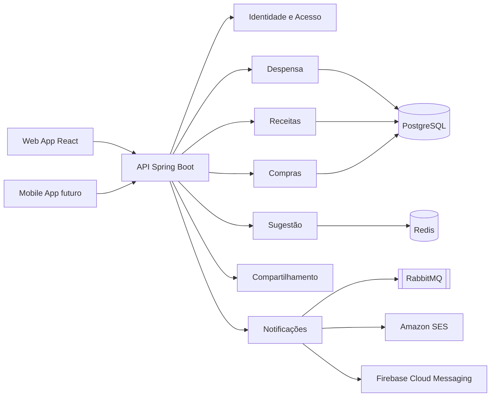
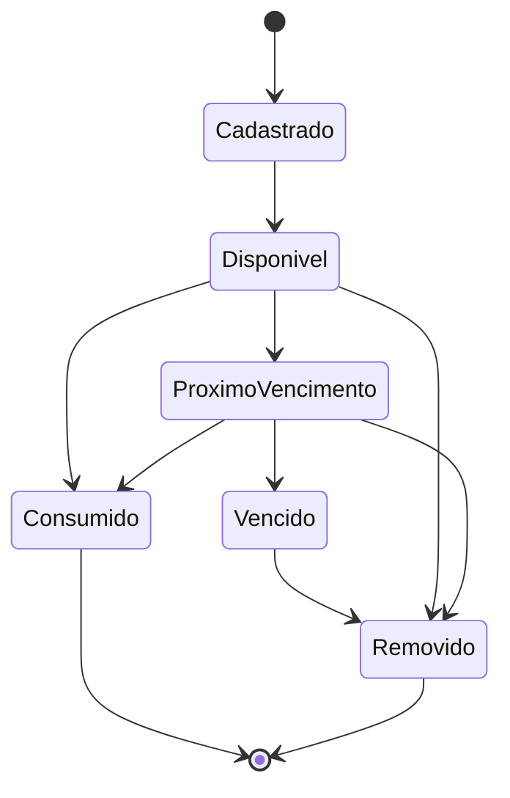
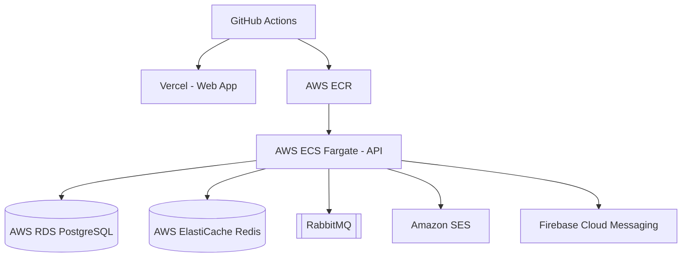
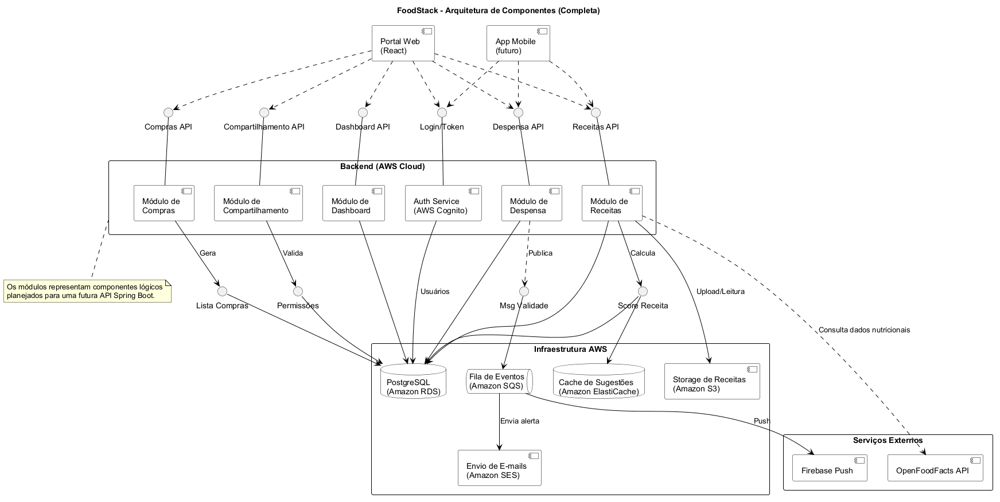
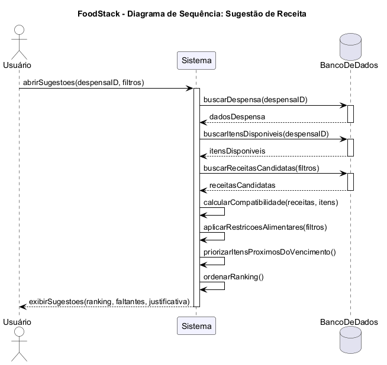
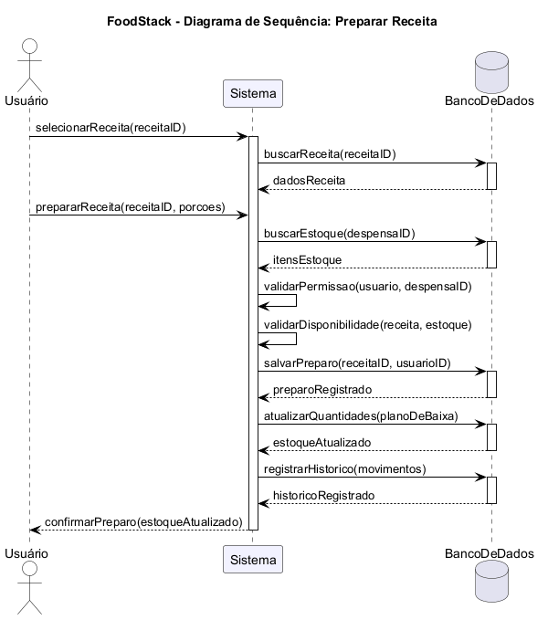
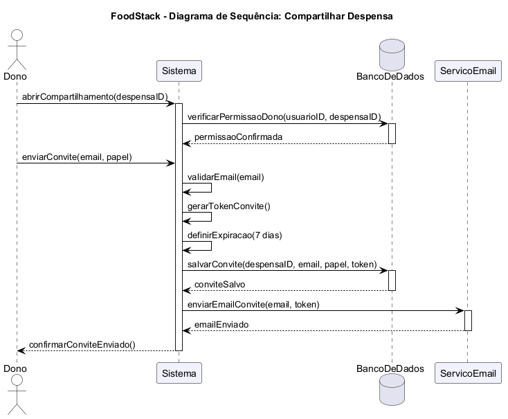
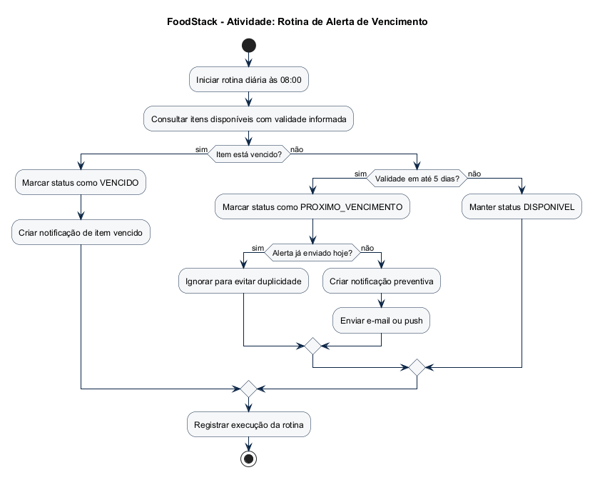
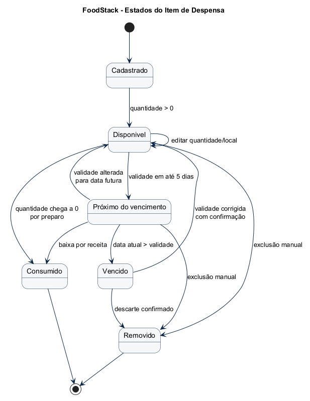
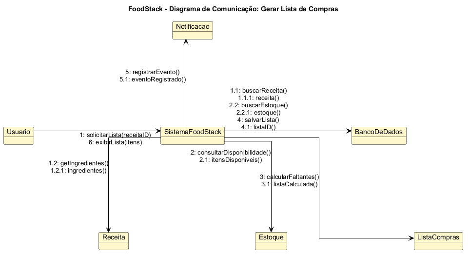

# FoodStack

> Despensa virtual e motor de recomendação de receitas baseado em estoque, validade, restrições alimentares e compartilhamento familiar.

<p align="center">
  
</p>

<p align="center">
  
  
  
  
</p>

<p align="center">
  
  
  
  
  
</p>

<h2 align="center">➡️ <a href="#galeria-diagramas">VER IMAGENS DOS DIAGRAMAS UML</a> ⬅️</h2>

<p align="center">
  <a href="#galeria-diagramas"><strong>Ir direto para a galeria renderizada dos arquivos PlantUML</strong></a>
</p>

---

<a id="atalhos"></a>

## Atalhos

| Área | Link |
|---|---|
| Entrega e escopo | [Escopo da entrega](#escopo-da-entrega) |
| Requisitos funcionais | [Requisitos funcionais](#requisitos-funcionais) |
| Histórias de usuário | [Histórias de usuário](#historias-de-usuario) |
| Requisitos não funcionais | [Requisitos não funcionais](#requisitos-nao-funcionais) |
| Regras de negócio | [Regras de negócio](#regras-de-negocio) |
| Contratos de operação | [Contratos de operação](#contratos-de-operacao) |
| Arquitetura | [Arquitetura de solução](#arquitetura-de-solucao) |
| **Imagens dos diagramas** | **[VER GALERIA UML RENDERIZADA](#galeria-diagramas)** |
| PlantUML | [Arquivos PlantUML](#diagramas-plantuml) |
| Modelo de dados | [Modelo de dados](#modelo-de-dados) |
| Segurança | [Segurança e privacidade](#seguranca-e-privacidade) |
| Rastreabilidade | [Matriz de rastreabilidade](#matriz-de-rastreabilidade) |
| Validação | [Validação da entrega](#validacao-da-entrega) |

---

## Sumário

- [1. Escopo da entrega](#escopo-da-entrega)
- [2. Visão do produto](#visao-do-produto)
- [3. Contexto e objetivos](#contexto-e-objetivos)
- [4. Requisitos funcionais](#requisitos-funcionais)
- [5. Histórias de usuário](#historias-de-usuario)
- [6. Requisitos não funcionais](#requisitos-nao-funcionais)
- [7. Regras de negócio](#regras-de-negocio)
- [8. Atores, perfis e permissões](#atores-perfis-e-permissoes)
- [9. Casos de uso](#casos-de-uso)
- [10. Contratos de operação](#contratos-de-operacao)
- [11. Arquitetura de solução](#arquitetura-de-solucao)
- [12. Decisões arquiteturais](#decisoes-arquiteturais)
- [13. Módulos e limites de contexto](#modulos-e-limites-de-contexto)
- [14. Modelo de domínio](#modelo-de-dominio)
- [15. Modelo de dados](#modelo-de-dados)
- [16. API planejada](#api-planejada)
- [17. Segurança e privacidade](#seguranca-e-privacidade)
- [18. Observabilidade](#observabilidade)
- [19. Estratégia de testes](#estrategia-de-testes)
- [20. Deploy planejado](#deploy-planejado)
- [21. Diagramas PlantUML e imagens renderizadas](#diagramas-plantuml)
- [22. Matriz de rastreabilidade](#matriz-de-rastreabilidade)
- [23. Estrutura do repositório](#estrutura-do-repositorio)
- [24. Validação da entrega](#validacao-da-entrega)
- [25. Referências](#referencias)

---

## Escopo da entrega

Este repositório contém a documentação técnica e a modelagem arquitetural do sistema **FoodStack**. Não há implementação de front-end, back-end, banco de dados executável ou infraestrutura real. O objetivo é entregar o projeto de software com README único e código PlantUML versionado.

| Exigência | Atendimento |
|---|---|
| Trabalho individual | Projeto identificado como entrega individual. |
| Uso obrigatório de PlantUML | Diagramas escritos em arquivos `.puml`. |
| Código PlantUML no repositório | Arquivos em [`docs/plantuml`](docs/plantuml). |
| Não desenvolver código | Repositório não possui código de aplicação. |
| Projeto, diagramação e arquitetura | Especificados integralmente neste README. |
| Template README solicitado | Contém status, descrição, funcionalidades, tecnologias, arquitetura, execução, deploy, testes, documentação, autor e licença. |
| Tecnologias fictícias | Stack planejada descrita para futura implementação. |

### Fora do escopo

- Implementação de telas.
- Implementação de API.
- Scripts de banco de dados.
- Integração real com serviços externos.
- Deploy real em cloud.
- Aplicativo mobile funcional.

[Voltar aos atalhos](#atalhos)

---

## Visão do produto

O FoodStack é um sistema para gestão de despensa doméstica, recomendação de receitas e redução de desperdício de alimentos. A aplicação registra o que existe em estoque, acompanha validade, sugere receitas compatíveis e gera lista de compras quando uma receita não pode ser preparada com os itens disponíveis.

### Problema

Residências costumam perder alimentos por falta de visibilidade do estoque, ausência de controle de validade e dificuldade de transformar ingredientes disponíveis em refeições. Isso causa desperdício, compras duplicadas e baixa previsibilidade no planejamento alimentar.

### Solução

Uma despensa virtual compartilhável, com:

- registro de ingredientes, quantidades, unidades, validade e local físico;
- cálculo de status de validade;
- recomendação de receitas por compatibilidade com estoque;
- priorização de ingredientes próximos ao vencimento;
- baixa automática após preparo de receita;
- lista de compras derivada de lacunas entre receita e estoque;
- compartilhamento de despensa com controle de permissões.

### Proposta de valor

| Valor | Descrição |
|---|---|
| Redução de desperdício | Itens próximos do vencimento são destacados e usados no ranking de receitas. |
| Planejamento alimentar | O usuário decide o que cozinhar com base em dados reais do estoque. |
| Controle doméstico | Quantidades e locais de armazenamento ficam centralizados. |
| Compra orientada | A lista de compras contém apenas itens ausentes ou insuficientes. |
| Operação familiar | Múltiplos membros podem manter a mesma despensa sincronizada. |

[Voltar aos atalhos](#atalhos)

---

## Contexto e objetivos

### Objetivos de negócio

| ID | Objetivo |
|---|---|
| OBJ-01 | Reduzir desperdício de alimentos por vencimento. |
| OBJ-02 | Melhorar a visibilidade do estoque doméstico. |
| OBJ-03 | Apoiar a decisão de preparo de refeições. |
| OBJ-04 | Evitar compras duplicadas ou desnecessárias. |
| OBJ-05 | Permitir colaboração familiar no controle da despensa. |

### Objetivos técnicos

| ID | Objetivo |
|---|---|
| OT-01 | Definir arquitetura modular com baixo acoplamento. |
| OT-02 | Preservar consistência transacional na baixa de estoque. |
| OT-03 | Separar domínio, aplicação, infraestrutura e interface. |
| OT-04 | Modelar entidades, casos de uso e fluxos críticos em PlantUML. |
| OT-05 | Planejar API, dados, segurança, observabilidade e testes. |

[Voltar aos atalhos](#atalhos)

---

## Requisitos funcionais

| ID | Requisito funcional |
|---|---|
| RF-01 | O sistema deve permitir cadastrar ingrediente na despensa com nome, quantidade, unidade de medida, local de armazenamento e validade opcional. |
| RF-02 | O sistema deve permitir editar quantidade, unidade, validade e local de armazenamento de um item. |
| RF-03 | O sistema deve permitir excluir item da despensa mediante confirmação. |
| RF-04 | O sistema deve listar itens disponíveis da despensa com filtros por local, validade, categoria e status. |
| RF-05 | O sistema deve classificar automaticamente itens como disponíveis, próximos do vencimento, vencidos, consumidos ou removidos. |
| RF-06 | O sistema deve notificar o usuário sobre itens próximos do vencimento. |
| RF-07 | O sistema deve sugerir receitas com base nos ingredientes disponíveis. |
| RF-08 | O sistema deve calcular percentual de compatibilidade entre receita e despensa. |
| RF-09 | O sistema deve permitir priorizar receitas que utilizam itens próximos do vencimento. |
| RF-10 | O sistema deve filtrar receitas por restrições alimentares. |
| RF-11 | O sistema deve permitir favoritar e desfavoritar receitas. |
| RF-12 | O sistema deve registrar uma receita como preparada e baixar automaticamente o estoque. |
| RF-13 | O sistema deve gerar lista de compras com ingredientes ausentes ou insuficientes para uma receita. |
| RF-14 | O sistema deve permitir cadastro de receitas próprias. |
| RF-15 | O sistema deve permitir compartilhar despensa com membros por convite. |
| RF-16 | O sistema deve controlar permissões de dono, editor e leitor. |
| RF-17 | O sistema deve registrar histórico das alterações de estoque. |
| RF-18 | O sistema deve explicar a recomendação de receita com ingredientes usados, faltantes e itens priorizados por validade. |

[Voltar aos atalhos](#atalhos)

---

## Histórias de usuário

As histórias abaixo descrevem o valor esperado pelo usuário final e servem como entrada para os casos de uso e contratos de operação.

| ID | História de usuário | Requisito associado |
|---|---|---|
| US-01 | Como usuário, eu quero adicionar novos ingredientes à minha despensa virtual informando nome e quantidade, para manter o controle do que tenho em casa. | RF-01 |
| US-02 | Como usuário, eu quero poder registrar a data de validade ao adicionar um ingrediente, para evitar o consumo de produtos estragados. | RF-01, RF-05 |
| US-03 | Como usuário, eu quero receber notificações sobre ingredientes que estão próximos da data de validade, para priorizar o uso desses itens e evitar o desperdício de alimentos. | RF-05, RF-06 |
| US-04 | Como usuário, eu quero visualizar uma lista completa de todos os itens disponíveis na minha despensa, para saber rapidamente o que tenho sem precisar abrir os armários. | RF-04 |
| US-05 | Como usuário, eu quero classificar onde o ingrediente está guardado, como Geladeira, Congelador ou Armário, para facilitar a localização física na minha cozinha. | RF-01, RF-02 |
| US-06 | Como usuário, eu quero alterar a quantidade ou excluir um ingrediente da despensa, para corrigir erros de cadastro ou registrar itens descartados. | RF-02, RF-03 |
| US-07 | Como usuário, eu quero que o sistema sugira receitas utilizando apenas ou majoritariamente os ingredientes que já possuo, para decidir o que cozinhar sem precisar ir ao mercado. | RF-07, RF-08 |
| US-08 | Como usuário, eu quero uma opção de sugerir receitas que utilizem especificamente os ingredientes que estão prestes a vencer, para não perder os alimentos que estão na geladeira. | RF-09 |
| US-09 | Como usuário, eu quero que ao marcar uma receita como preparada o sistema subtraia automaticamente as quantidades utilizadas da minha despensa virtual, para manter o estoque sempre atualizado. | RF-12, RF-17 |
| US-10 | Como usuário, eu quero filtrar as receitas sugeridas por restrições, como sem glúten ou vegetariano, para garantir que as sugestões atendam à minha dieta. | RF-10 |
| US-11 | Como usuário, eu quero salvar as receitas sugeridas em uma lista de favoritos, para poder encontrá-las facilmente no futuro. | RF-11 |
| US-12 | Como usuário, eu quero escolher uma receita que desejo fazer e que o sistema gere automaticamente uma lista de compras com os ingredientes que faltam na minha despensa, para facilitar minha ida ao mercado. | RF-13 |
| US-13 | Como usuário, eu quero poder cadastrar minhas próprias receitas no banco de dados do sistema, para que elas também apareçam nas sugestões quando eu tiver os ingredientes. | RF-14 |
| US-14 | Como usuário, eu quero compartilhar o acesso da minha despensa com outros membros da família, para que todos possam adicionar ou remover itens de forma sincronizada. | RF-15, RF-16 |

[Voltar aos atalhos](#atalhos)

---

## Requisitos não funcionais

| ID | Categoria | Requisito não funcional |
|---|---|---|
| RNF-01 | Segurança | Todas as operações protegidas devem exigir autenticação e autorização no back-end. |
| RNF-02 | Segurança | Senhas devem ser armazenadas com hash forte e sal. |
| RNF-03 | Segurança | Tokens JWT devem possuir expiração e assinatura com segredo seguro. |
| RNF-04 | Privacidade | Logs não devem registrar senha, token, segredo ou dados sensíveis. |
| RNF-05 | Performance | Consulta de estoque deve responder em até 500 ms para despensas comuns. |
| RNF-06 | Performance | Sugestão de receitas deve responder em até 2 s para catálogo inicial. |
| RNF-07 | Confiabilidade | Baixa automática de estoque deve ser transacional. |
| RNF-08 | Disponibilidade | Sistema deve ser planejado para execução em containers. |
| RNF-09 | Observabilidade | API deve expor métricas, logs estruturados e rastreio de requisições. |
| RNF-10 | Manutenibilidade | Módulos de domínio não devem depender diretamente de frameworks de infraestrutura. |
| RNF-11 | Testabilidade | Regras de negócio devem ser testáveis isoladamente. |
| RNF-12 | Acessibilidade | Interface futura deve seguir boas práticas de contraste, navegação por teclado e textos claros. |
| RNF-13 | Portabilidade | Ambiente local planejado deve ser reproduzível por Docker Compose. |
| RNF-14 | Auditoria | Operações críticas de estoque e compartilhamento devem gerar histórico. |

[Voltar aos atalhos](#atalhos)

---

## Regras de negócio

### Estoque e validade

| ID | Regra |
|---|---|
| RN-01 | Todo item de despensa deve possuir nome, quantidade positiva, unidade de medida e local de armazenamento. |
| RN-02 | A data de validade é opcional, mas datas vencidas exigem confirmação explícita. |
| RN-03 | Item com validade em até 5 dias corridos deve ser classificado como próximo do vencimento. |
| RN-04 | Item vencido não deve participar de sugestão sem aviso explícito ao usuário. |
| RN-05 | Itens com quantidade igual a zero não devem aparecer como disponíveis. |
| RN-06 | Alterações de estoque devem registrar usuário, data, operação e motivo quando aplicável. |
| RN-07 | Itens equivalentes podem ser consolidados quando possuírem mesmo ingrediente, unidade, validade e local. |
| RN-08 | Exclusão de item disponível exige confirmação. |

### Receitas e recomendação

| ID | Regra |
|---|---|
| RN-09 | Compatibilidade de receita deve considerar ingredientes obrigatórios disponíveis sobre ingredientes obrigatórios totais. |
| RN-10 | Ingredientes opcionais podem aumentar a pontuação, mas não devem impedir recomendação. |
| RN-11 | O modo de priorização por vencimento deve adicionar peso para receitas que utilizam itens próximos da validade. |
| RN-12 | Receita filtrada por restrição alimentar não pode conter ingrediente incompatível com a restrição selecionada. |
| RN-13 | O sistema deve retornar justificativa da recomendação. |
| RN-14 | Favoritos são pessoais e não são compartilhados automaticamente. |
| RN-15 | Receita própria deve possuir nome, modo de preparo e pelo menos um ingrediente. |

### Baixa e lista de compras

| ID | Regra |
|---|---|
| RN-16 | Preparar receita exige estoque suficiente para todos os ingredientes obrigatórios. |
| RN-17 | Baixa automática deve ocorrer em transação única. |
| RN-18 | Falha em qualquer item da baixa cancela toda a operação. |
| RN-19 | Lista de compras deve conter somente itens ausentes ou insuficientes. |
| RN-20 | Quantidade da lista de compras deve ser a diferença entre necessidade e disponibilidade. |

### Compartilhamento

| ID | Regra |
|---|---|
| RN-21 | Toda despensa deve possuir exatamente um dono. |
| RN-22 | Convite de compartilhamento expira após 7 dias ou após aceite. |
| RN-23 | Perfil leitor consulta, mas não altera estoque. |
| RN-24 | Perfil editor cadastra, altera e remove itens, mas não gerencia membros. |
| RN-25 | Dono gerencia membros, convites, permissões e exclusão da despensa. |

[Voltar aos atalhos](#atalhos)

---

## Atores, perfis e permissões

| Ator | Descrição | Permissões principais |
|---|---|---|
| Usuário autenticado | Pessoa com conta ativa no sistema. | Criar despensa, cadastrar itens, consultar receitas e gerenciar dados próprios. |
| Dono da despensa | Responsável administrativo por uma despensa. | Gerenciar membros, convites, permissões, estoque e exclusão da despensa. |
| Editor | Membro com permissão operacional. | Cadastrar, editar, remover itens e marcar receitas como preparadas. |
| Leitor | Membro com acesso de consulta. | Consultar estoque, receitas e listas, sem modificar dados. |
| Serviço de notificação | Componente externo/interno de envio. | Enviar alertas por push, e-mail ou notificação interna. |
| Catálogo de receitas | Fonte de receitas internas ou próprias. | Fornecer receitas candidatas para recomendação. |

### Matriz de permissões

| Operação | Dono | Editor | Leitor |
|---|---:|---:|---:|
| Consultar estoque | Sim | Sim | Sim |
| Cadastrar item | Sim | Sim | Não |
| Editar item | Sim | Sim | Não |
| Remover item | Sim | Sim | Não |
| Preparar receita e baixar estoque | Sim | Sim | Não |
| Gerar lista de compras | Sim | Sim | Sim |
| Convidar membro | Sim | Não | Não |
| Alterar permissões | Sim | Não | Não |
| Excluir despensa | Sim | Não | Não |

[Voltar aos atalhos](#atalhos)

---

## Casos de uso

| ID | Caso de uso | Ator primário | Resultado esperado |
|---|---|---|---|
| UC-01 | Cadastrar ingrediente | Usuário / Editor | Item criado na despensa. |
| UC-02 | Registrar validade | Usuário / Editor | Item salvo com data e status calculável. |
| UC-03 | Receber alerta de vencimento | Usuário | Notificação preventiva gerada. |
| UC-04 | Consultar estoque atual | Usuário / Membro | Lista filtrável de itens disponíveis. |
| UC-05 | Classificar armazenamento | Usuário / Editor | Item vinculado a local físico. |
| UC-06 | Editar ou excluir ingrediente | Usuário / Editor | Estoque corrigido e histórico registrado. |
| UC-07 | Sugerir receitas por estoque | Usuário | Ranking de receitas compatíveis. |
| UC-08 | Priorizar itens perto do vencimento | Usuário | Ranking ponderado por urgência de validade. |
| UC-09 | Marcar receita como preparada | Usuário / Editor | Estoque baixado transacionalmente. |
| UC-10 | Filtrar por restrição alimentar | Usuário | Receitas incompatíveis removidas. |
| UC-11 | Favoritar receita | Usuário | Receita salva nos favoritos. |
| UC-12 | Gerar lista de compras | Usuário | Lista com itens faltantes. |
| UC-13 | Cadastrar receita própria | Usuário | Receita criada no catálogo pessoal. |
| UC-14 | Compartilhar despensa | Dono | Convite criado para novo membro. |

[Voltar aos atalhos](#atalhos)

---

## Contratos de operação

| Contrato | Operação | Responsabilidade | Pré-condições | Pós-condições | Falhas esperadas |
|---|---|---|---|---|---|
| CO-01 | `cadastrarIngrediente(despensaId, item)` | Criar item de estoque. | Usuário autenticado com permissão de escrita. | Item persistido e histórico registrado. | Quantidade inválida, unidade inválida, despensa inexistente, acesso negado. |
| CO-02 | `consultarEstoque(despensaId, filtros)` | Retornar estoque filtrado. | Usuário membro da despensa. | Lista de itens com status de validade. | Despensa inexistente, acesso negado. |
| CO-03 | `sugerirReceitas(despensaId, filtros)` | Gerar ranking de receitas. | Despensa acessível com itens disponíveis. | Lista ordenada por compatibilidade e justificativa. | Catálogo vazio, restrição inválida, despensa sem itens. |
| CO-04 | `prepararReceita(despensaId, receitaId, porcoes)` | Registrar preparo e baixar estoque. | Receita existente, estoque suficiente e permissão de escrita. | Preparo e movimentos de estoque confirmados. | Estoque insuficiente, conflito concorrente, acesso negado. |
| CO-05 | `gerarListaCompras(despensaId, receitaId, porcoes)` | Calcular faltantes. | Receita existente e acesso à despensa. | Lista criada com quantidades faltantes. | Unidade incompatível, receita inexistente. |
| CO-06 | `convidarMembro(despensaId, email, papel)` | Criar convite de compartilhamento. | Usuário é dono da despensa. | Convite pendente criado e notificação enviada. | E-mail inválido, convite duplicado, papel inválido. |
| CO-07 | `cadastrarReceitaPropria(usuarioId, receita)` | Registrar receita do usuário. | Receita possui nome, preparo e ingredientes. | Receita disponível para recomendação. | Receita inválida, ingrediente sem unidade. |

[Voltar aos atalhos](#atalhos)

---

## Arquitetura de solução

### Estilo arquitetural

O FoodStack foi projetado como **monólito modular orientado a domínio**, com separação entre interface, aplicação, domínio e infraestrutura.

Motivação:

- reduz custo operacional para a primeira versão;
- mantém fronteiras internas claras;
- permite testes isolados de regras de negócio;
- preserva consistência transacional em operações críticas;
- evita complexidade prematura de microsserviços.

### Visão lógica



### Camadas

| Camada | Responsabilidade |
|---|---|
| Interface | Aplicações cliente e consumo da API. |
| API / Controllers | Contratos HTTP, autenticação, validação de entrada e serialização. |
| Aplicação | Orquestra casos de uso, transações, permissões e eventos. |
| Domínio | Entidades, agregados, políticas, invariantes e regras de negócio. |
| Infraestrutura | Persistência, mensageria, cache, provedores externos e configuração. |

### Fluxo transacional crítico

O caso `prepararReceita` possui maior risco de inconsistência. O fluxo planejado é:

1. Validar autenticação e permissão de escrita.
2. Carregar receita e ingredientes obrigatórios.
3. Carregar itens disponíveis da despensa com bloqueio transacional.
4. Validar quantidade suficiente.
5. Registrar preparo.
6. Subtrair quantidades do estoque.
7. Registrar histórico de cada movimento.
8. Confirmar transação.
9. Publicar evento `ReceitaPreparada`.

[Voltar aos atalhos](#atalhos)

---

## Decisões arquiteturais

| ID | Decisão | Justificativa | Consequência |
|---|---|---|---|
| ADR-01 | Usar monólito modular | O domínio ainda é coeso e não exige distribuição física. | Menor complexidade operacional e evolução controlada. |
| ADR-02 | Usar PostgreSQL | Estoque, preparo e lista de compras exigem integridade relacional. | Transações confiáveis e consultas consistentes. |
| ADR-03 | Usar eventos internos | Alertas e histórico não devem acoplar diretamente todos os módulos. | Melhor separação, com atenção a rastreabilidade. |
| ADR-04 | Usar Redis para cache planejado | Sugestões podem repetir consultas de catálogo e estoque. | Melhora performance, exige invalidação correta. |
| ADR-05 | Usar JWT | API REST stateless simplifica clientes web/mobile. | Requer expiração, rotação e proteção de segredo. |
| ADR-06 | Manter PlantUML versionado | O exercício exige código PlantUML e facilita auditoria do diagrama. | Diagramas são reprodutíveis por qualquer avaliador. |

[Voltar aos atalhos](#atalhos)

---

## Módulos e limites de contexto

| Módulo | Responsabilidade | Não deve fazer |
|---|---|---|
| Identidade | Usuários, autenticação, tokens e autorização. | Calcular receitas ou manipular estoque. |
| Despensa | Itens, quantidades, validade, local e histórico. | Conhecer detalhes de envio de notificação externa. |
| Receitas | Cadastro, composição, restrições e favoritos. | Baixar estoque diretamente. |
| Sugestão | Compatibilidade, ranking e justificativa. | Persistir movimento de estoque. |
| Compras | Diferença entre receita e estoque para compra. | Alterar receita ou item de despensa. |
| Compartilhamento | Convites, membros e papéis. | Executar regras de recomendação. |
| Notificações | Preparar e enviar alertas. | Decidir regra de validade por conta própria. |

[Voltar aos atalhos](#atalhos)

---

## Modelo de domínio

### Entidades principais

| Entidade | Papel no domínio |
|---|---|
| `Usuario` | Representa identidade autenticada. |
| `Despensa` | Agregado raiz para estoque doméstico. |
| `MembroDespensa` | Associação entre usuário, despensa e papel. |
| `ConviteCompartilhamento` | Convite com token, papel e expiração. |
| `Ingrediente` | Item normalizado do catálogo de ingredientes. |
| `ItemDespensa` | Ingrediente efetivamente disponível em estoque. |
| `HistoricoEstoque` | Auditoria de alterações de item. |
| `Receita` | Receita de catálogo ou criada pelo usuário. |
| `IngredienteReceita` | Quantidade necessária de ingrediente por receita. |
| `RestricaoAlimentar` | Classificação alimentar aplicável a receitas. |
| `FavoritoReceita` | Vínculo pessoal entre usuário e receita. |
| `ListaCompras` | Agregado de itens faltantes para uma receita. |
| `Notificacao` | Mensagem de alerta ou informação ao usuário. |

### Estados de `ItemDespensa`



[Voltar aos atalhos](#atalhos)

---

## Modelo de dados

O modelo relacional planejado usa PostgreSQL 16. A escolha privilegia consistência, integridade referencial, histórico de alterações e transações.

| Tabela | Finalidade |
|---|---|
| `usuarios` | Conta e identidade do usuário. |
| `despensas` | Despensas criadas pelos usuários. |
| `membros_despensa` | Papel de cada usuário em cada despensa. |
| `convites_compartilhamento` | Convites pendentes, aceitos ou expirados. |
| `ingredientes` | Catálogo normalizado de ingredientes. |
| `itens_despensa` | Estoque disponível, validade e local físico. |
| `historico_estoque` | Auditoria de movimentos e correções. |
| `receitas` | Receitas públicas ou próprias. |
| `ingredientes_receita` | Composição das receitas. |
| `restricoes_alimentares` | Catálogo de restrições alimentares. |
| `receita_restricao` | Associação entre receitas e restrições. |
| `favoritos_receita` | Favoritos pessoais. |
| `listas_compras` | Listas geradas a partir de receitas. |
| `itens_lista_compras` | Itens ausentes ou insuficientes. |
| `notificacoes` | Alertas enviados ao usuário. |

### Índices planejados

| Tabela | Índice | Motivo |
|---|---|---|
| `usuarios` | `uk_usuarios_email` | Login e unicidade de e-mail. |
| `ingredientes` | `idx_ingredientes_nome_normalizado` | Busca por ingrediente sem acento e case insensitive. |
| `itens_despensa` | `idx_itens_despensa_despensa_status` | Consulta do estoque disponível. |
| `itens_despensa` | `idx_itens_despensa_validade` | Rotina de vencimento. |
| `receitas` | `idx_receitas_criador` | Listagem de receitas próprias. |
| `favoritos_receita` | `uk_favorito_usuario_receita` | Evita favorito duplicado. |
| `convites_compartilhamento` | `idx_convite_token` | Aceite de convite por token. |

[Voltar aos atalhos](#atalhos)

---

## API planejada

A API abaixo representa o contrato planejado para uma implementação futura.

| Método | Endpoint | Descrição |
|---|---|---|
| `POST` | `/api/auth/register` | Registra usuário. |
| `POST` | `/api/auth/login` | Autentica e retorna token. |
| `GET` | `/api/despensas/{id}/itens` | Lista estoque. |
| `POST` | `/api/despensas/{id}/itens` | Cadastra item. |
| `PUT` | `/api/despensas/{id}/itens/{itemId}` | Edita item. |
| `DELETE` | `/api/despensas/{id}/itens/{itemId}` | Remove item. |
| `GET` | `/api/despensas/{id}/sugestoes` | Sugere receitas. |
| `POST` | `/api/receitas/{id}/preparos` | Marca receita como preparada. |
| `POST` | `/api/receitas` | Cadastra receita própria. |
| `POST` | `/api/receitas/{id}/favoritos` | Favorita receita. |
| `DELETE` | `/api/receitas/{id}/favoritos` | Remove favorito. |
| `POST` | `/api/despensas/{id}/listas-compras` | Gera lista de compras. |
| `POST` | `/api/despensas/{id}/convites` | Cria convite. |
| `POST` | `/api/convites/{token}/aceite` | Aceita convite. |

### Exemplo de resposta de sugestão

```json
{
  "receitaId": "4b3b3d0a-3fb1-4b18-9c8c-0e30f44fd901",
  "nome": "Omelete de legumes",
  "compatibilidade": 0.92,
  "prioridadeVencimento": 0.35,
  "ingredientesUsados": ["ovos", "tomate", "queijo"],
  "ingredientesFaltantes": ["cebolinha"],
  "justificativa": "Usa tomate com vencimento em 2 dias e aproveita 92% dos ingredientes obrigatórios disponíveis."
}
```

### Códigos HTTP esperados

| Código | Uso |
|---|---|
| `200 OK` | Consulta ou operação concluída. |
| `201 Created` | Recurso criado. |
| `400 Bad Request` | Entrada inválida. |
| `401 Unauthorized` | Usuário não autenticado. |
| `403 Forbidden` | Usuário sem permissão. |
| `404 Not Found` | Recurso inexistente. |
| `409 Conflict` | Estoque insuficiente ou conflito transacional. |
| `422 Unprocessable Entity` | Regra de negócio violada. |

[Voltar aos atalhos](#atalhos)

---

## Segurança e privacidade

| Controle | Descrição |
|---|---|
| Autenticação | JWT com expiração e assinatura segura. |
| Autorização | Verificação por despensa e papel do membro. |
| Senhas | Hash forte com sal. |
| Convites | Token opaco, expiração de 7 dias e invalidação após aceite. |
| Logs | Sem senhas, tokens ou dados sensíveis. |
| Transporte | HTTPS obrigatório em produção. |
| CORS | Liberado somente para origens confiáveis. |
| Auditoria | Histórico de alterações de estoque e compartilhamento. |
| Menor privilégio | Perfil leitor não executa mutações. |

[Voltar aos atalhos](#atalhos)

---

## Observabilidade

| Recurso | Planejamento |
|---|---|
| Logs estruturados | JSON com `requestId`, `userId`, `despensaId`, operação e resultado. |
| Métricas | Latência, erros por endpoint, sugestões geradas, alertas enviados e falhas de baixa. |
| Tracing | Propagação de correlação entre API, filas e notificações. |
| Alertas técnicos | Erro elevado em preparo, falha de notificação e tempo alto de sugestão. |
| Auditoria funcional | Histórico de estoque separado de logs técnicos. |

[Voltar aos atalhos](#atalhos)

---

## Estratégia de testes

| Tipo | Ferramentas planejadas | Cobertura esperada |
|---|---|---|
| Unidade | JUnit, Mockito, Vitest | Políticas de validade, compatibilidade, permissões e baixa. |
| Integração | Spring Boot Test, Testcontainers | Repositórios, transações e constraints. |
| Contrato | OpenAPI, Schemathesis | Consistência de endpoints e DTOs. |
| Arquitetura | ArchUnit | Restrições entre camadas e módulos. |
| E2E | Playwright | Cadastro de item, sugestão, preparo e compartilhamento. |
| Regressão documental | PlantUML | Sintaxe dos diagramas e existência dos arquivos `.puml`. |

### Cenários críticos de teste

| Cenário | Resultado esperado |
|---|---|
| Preparar receita com estoque suficiente | Estoque baixado e histórico criado. |
| Preparar receita com item insuficiente | Operação rejeitada sem baixa parcial. |
| Sugestão com restrição alimentar | Receitas incompatíveis removidas. |
| Item próximo do vencimento | Alerta gerado no limite de 5 dias. |
| Convite expirado | Aceite bloqueado. |
| Usuário leitor tenta editar estoque | Operação negada. |

[Voltar aos atalhos](#atalhos)

---

## Deploy planejado



| Camada | Tecnologia planejada |
|---|---|
| Web | Vercel |
| API | AWS ECS Fargate |
| Imagens | AWS ECR |
| Banco | AWS RDS PostgreSQL |
| Cache | AWS ElastiCache Redis |
| Eventos | RabbitMQ ou Amazon MQ |
| E-mail | Amazon SES |
| Push | Firebase Cloud Messaging |
| CI/CD | GitHub Actions |

[Voltar aos atalhos](#atalhos)

---

## Diagramas PlantUML

O código PlantUML obrigatório está em [`docs/plantuml`](docs/plantuml) e as imagens renderizadas estão em [`docs/diagramas`](docs/diagramas).

<a id="galeria-diagramas"></a>

### Galeria visual dos diagramas

> As imagens abaixo foram geradas a partir dos arquivos `.puml` do projeto. Cada item também mantém o link direto para o código PlantUML correspondente.

#### 01 - Diagrama de Casos de Uso

[Código PlantUML](docs/plantuml/01-casos-de-uso.puml)

<p align="center">
  
</p>

#### 02 - Diagrama de Componentes

[Código PlantUML](docs/plantuml/02-arquitetura-componentes.puml)

<p align="center">
  
</p>

#### 03 - Diagrama de Classes

[Código PlantUML](docs/plantuml/03-diagrama-classes.puml)

<p align="center">
  
</p>

#### 04 - Modelo de Dados / DER

[Código PlantUML](docs/plantuml/04-modelo-dados-der.puml)

<p align="center">
  
</p>

#### 05 - Diagrama de Sequência: Sugestão de Receita

[Código PlantUML](docs/plantuml/05-sequencia-sugestao-receita.puml)

<p align="center">
  
</p>

#### 06 - Diagrama de Sequência: Preparar Receita

[Código PlantUML](docs/plantuml/06-sequencia-preparar-receita.puml)

<p align="center">
  
</p>

#### 07 - Diagrama de Sequência: Compartilhar Despensa

[Código PlantUML](docs/plantuml/07-sequencia-compartilhar-despensa.puml)

<p align="center">
  
</p>

#### 08 - Diagrama de Atividade: Alerta de Vencimento

[Código PlantUML](docs/plantuml/08-atividade-alerta-vencimento.puml)

<p align="center">
  
</p>

#### 09 - Diagrama de Estados: Item de Despensa

[Código PlantUML](docs/plantuml/09-estados-item-despensa.puml)

<p align="center">
  
</p>

#### 10 - Diagrama de Comunicação: Lista de Compras

[Código PlantUML](docs/plantuml/10-comunicacao-lista-compras.puml)

<p align="center">
  
</p>

#### 11 - Diagrama de Implantação

[Código PlantUML](docs/plantuml/11-implantacao.puml)

<p align="center">
  
</p>

### Arquivos PlantUML

| Arquivo | Tipo | Cobertura |
|---|---|---|
| [`01-casos-de-uso.puml`](docs/plantuml/01-casos-de-uso.puml) | Caso de uso | Atores e funcionalidades externas. |
| [`02-arquitetura-componentes.puml`](docs/plantuml/02-arquitetura-componentes.puml) | Componentes | Módulos, serviços e integrações. |
| [`03-diagrama-classes.puml`](docs/plantuml/03-diagrama-classes.puml) | Classes | Modelo orientado a objetos do domínio. |
| [`04-modelo-dados-der.puml`](docs/plantuml/04-modelo-dados-der.puml) | DER | Modelo relacional planejado. |
| [`05-sequencia-sugestao-receita.puml`](docs/plantuml/05-sequencia-sugestao-receita.puml) | Sequência | Sugestão de receitas. |
| [`06-sequencia-preparar-receita.puml`](docs/plantuml/06-sequencia-preparar-receita.puml) | Sequência | Preparo de receita e baixa de estoque. |
| [`07-sequencia-compartilhar-despensa.puml`](docs/plantuml/07-sequencia-compartilhar-despensa.puml) | Sequência | Compartilhamento por convite. |
| [`08-atividade-alerta-vencimento.puml`](docs/plantuml/08-atividade-alerta-vencimento.puml) | Atividade | Rotina de alerta de vencimento. |
| [`09-estados-item-despensa.puml`](docs/plantuml/09-estados-item-despensa.puml) | Estados | Ciclo de vida do item. |
| [`10-comunicacao-lista-compras.puml`](docs/plantuml/10-comunicacao-lista-compras.puml) | Comunicação | Colaboração para gerar lista de compras. |
| [`11-implantacao.puml`](docs/plantuml/11-implantacao.puml) | Implantação | Distribuição planejada em cloud. |

### Renderização local

```bash
java -jar plantuml.jar -tpng docs/plantuml/*.puml
```

[Voltar aos atalhos](#atalhos)

---

## Matriz de rastreabilidade

| História | RF | RN | Caso de uso | Diagrama |
|---|---|---|---|---|
| US-01 | RF-01 | RN-01, RN-07 | UC-01 | `01`, `03` |
| US-02 | RF-01, RF-05 | RN-02, RN-03 | UC-02 | `01`, `09` |
| US-03 | RF-05, RF-06 | RN-03, RN-04 | UC-03 | `08` |
| US-04 | RF-04 | RN-05 | UC-04 | `01`, `04` |
| US-05 | RF-01, RF-02 | RN-01 | UC-05 | `03` |
| US-06 | RF-02, RF-03 | RN-06, RN-08 | UC-06 | `03`, `09` |
| US-07 | RF-07, RF-08 | RN-09, RN-13 | UC-07 | `05` |
| US-08 | RF-09 | RN-11 | UC-08 | `05`, `08` |
| US-09 | RF-12, RF-17 | RN-16, RN-17, RN-18 | UC-09 | `06`, `09` |
| US-10 | RF-10 | RN-12 | UC-10 | `05` |
| US-11 | RF-11 | RN-14 | UC-11 | `03` |
| US-12 | RF-13 | RN-19, RN-20 | UC-12 | `10` |
| US-13 | RF-14 | RN-15 | UC-13 | `03`, `04` |
| US-14 | RF-15, RF-16 | RN-21 a RN-25 | UC-14 | `07` |

[Voltar aos atalhos](#atalhos)

---

## Estrutura do repositório

```text
foodstack/
├── README.md
├── LICENSE
├── .gitignore
├── assets/
│   ├── logo-foodstack.svg
│   └── logo-foodstack.png
└── docs/
    ├── diagramas/
    │   ├── 01-casos-de-uso.png
    │   ├── 02-arquitetura-componentes.png
    │   ├── 03-diagrama-classes.png
    │   ├── 04-modelo-dados-der.png
    │   ├── 05-sequencia-sugestao-receita.png
    │   ├── 06-sequencia-preparar-receita.png
    │   ├── 07-sequencia-compartilhar-despensa.png
    │   ├── 08-atividade-alerta-vencimento.png
    │   ├── 09-estados-item-despensa.png
    │   ├── 10-comunicacao-lista-compras.png
    │   └── 11-implantacao.png
    └── plantuml/
        ├── 01-casos-de-uso.puml
        ├── 02-arquitetura-componentes.puml
        ├── 03-diagrama-classes.puml
        ├── 04-modelo-dados-der.puml
        ├── 05-sequencia-sugestao-receita.puml
        ├── 06-sequencia-preparar-receita.puml
        ├── 07-sequencia-compartilhar-despensa.puml
        ├── 08-atividade-alerta-vencimento.puml
        ├── 09-estados-item-despensa.puml
        ├── 10-comunicacao-lista-compras.puml
        └── 11-implantacao.puml
```

[Voltar aos atalhos](#atalhos)

---

## Validação da entrega

| Verificação | Resultado |
|---|---|
| README único com especificação completa | OK |
| Outros arquivos Markdown removidos | OK |
| Pasta `docs/plantuml` contém o código PlantUML obrigatório | OK |
| Pasta `docs/diagramas` contém as imagens renderizadas usadas no README | OK |
| Código de aplicação ausente | OK |
| 11 arquivos `.puml` versionados | OK |
| 11 imagens `.png` renderizadas e exibidas no README | OK |
| PlantUML renderiza sem erro de sintaxe | OK |
| Requisitos, regras, contratos, arquitetura e rastreabilidade no README | OK |

[Voltar aos atalhos](#atalhos)

---

## Referências

- Template README solicitado: https://github.com/joaopauloaramuni/laboratorio-de-desenvolvimento-de-software/blob/main/TEMPLATES/template_README.md
- PlantUML: https://plantuml.com/
- C4 Model: https://c4model.com/
- Spring Boot: https://spring.io/projects/spring-boot
- React: https://react.dev/
- PostgreSQL: https://www.postgresql.org/docs/
- Docker: https://docs.docker.com/

---

## Autor

| Campo | Informação |
|---|---|
| Projeto | FoodStack |
| Tema | Despensa virtual e gerador inteligente de receitas |
| Tipo | Projeto técnico, documentação, arquitetura e diagramas |
| Entrega | README único + PlantUML |
| Versão | 1.0.0 |
| Data | 07/06/2026 |

---

## Licença

Distribuído sob licença MIT. Consulte [`LICENSE`](LICENSE).
