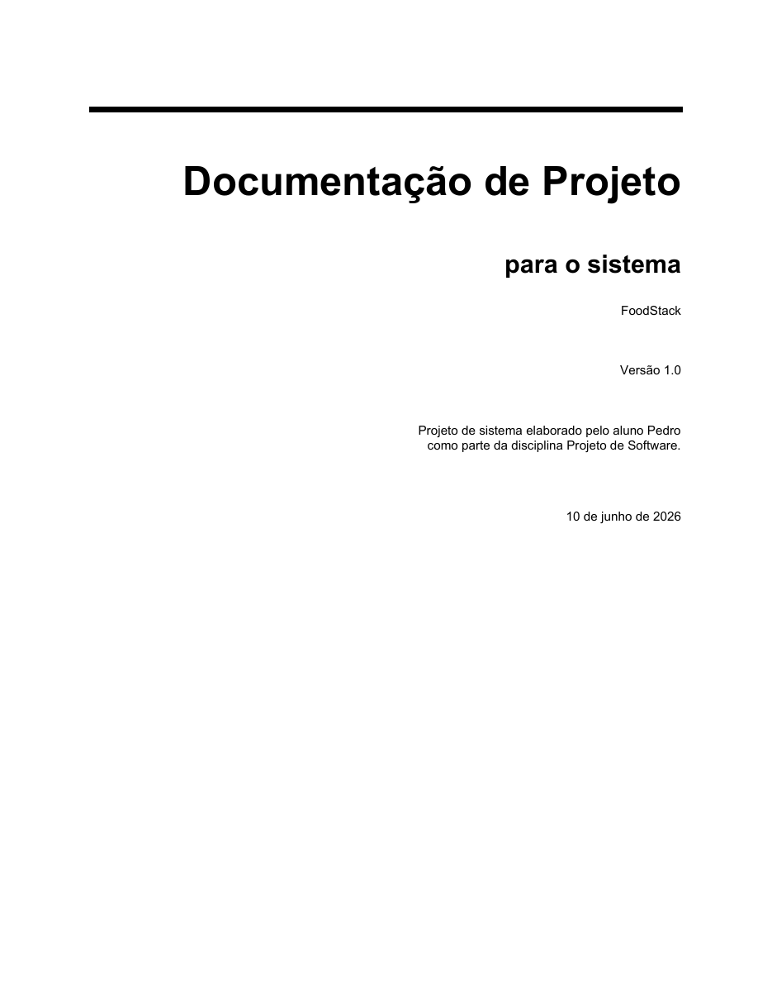

# 📚 Documentação do FoodStack

**Professor:** Prof. Dr. João Paulo Aramuni | [GitHub](https://github.com/joaopauloaramuni)

> [!IMPORTANT]
> A versão em PDF é a principal para leitura e conferência no GitHub.

  

## 📄 Arquivos principais

- [**Abrir a documentação completa em PDF**](./FoodStack%20-%20Documenta%C3%A7%C3%A3o%20de%20Projeto.pdf)
- [Baixar a versão editável em Word](./FoodStack%20-%20Documenta%C3%A7%C3%A3o%20de%20Projeto.docx)
- [Voltar ao README principal](../README.md)

O PDF possui **19 páginas** e reúne requisitos, atores, casos de uso, contratos de operação, arquitetura, componentes, implantação, classes, sequências, comunicação, estados e modelo de dados.

## 🌱 Artefatos UML

- [Diagramas renderizados](./diagramas)
- [Códigos-fonte PlantUML](./plantuml)
